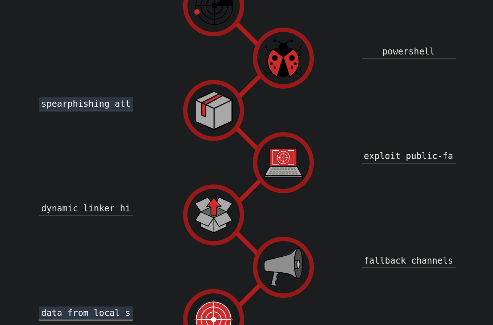
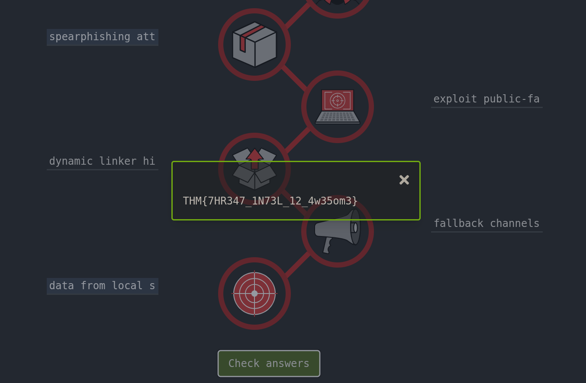

# Cyber Kill Chain — CTF Exercise

This write-up documents a practical exercise where I built the **Cyber Kill Chain** for a real-world scenario (the Target breach). The task involved placing given artefacts/techniques into the correct Kill Chain stages on a static site and submitting the answers.

---

## 🧾 Scenario
**Target breach (Nov 27 – Dec 15, 2013):** a large-scale data breach that exposed ~40 million card records.  
The exercise asks you to deploy a provided static site and map the following items into the correct Kill Chain stages:

- exploit public-facing application  
- data from local system  
- powershell  
- dynamic linker hijacking  
- spearphishing attachment  
- fallback channels

---

## 📸 Screenshots
1. **CTF7.png** — My filled answers beside each Kill Chain stage (submitted answers).  
   

2. **CTF8.png** — The challenge flag / success screen shown after completing the exercise.  
   

---

## 📝 What I Did
- Read the scenario and reviewed the list of items to place into the Kill Chain.  
- Deployed and used the provided static site UI to add each item into the corresponding Kill Chain entry form.  
- Used the “Check answers” button to verify correctness.

---

## 🔍 Observations & Notes
- The exercise was straightforward — a fill-in-the-blanks mapping task.  
- I completed it in a **single try** and received the flag immediately (see **CTF8.png**).  
- This kind of exercise is useful for reinforcing the mapping between concrete artefacts/techniques and Kill Chain stages (Recon → Weaponization → Delivery → Exploitation → Installation → C2 → Actions on Objectives).

---

## ✅ Outcome & Reflection
- Finished successfully on the first attempt and obtained the flag.  
- Good reinforcement of how real-world incidents can be deconstructed into Kill Chain stages — a helpful activity for both red-team emulation planning and blue-team incident analysis.

---
