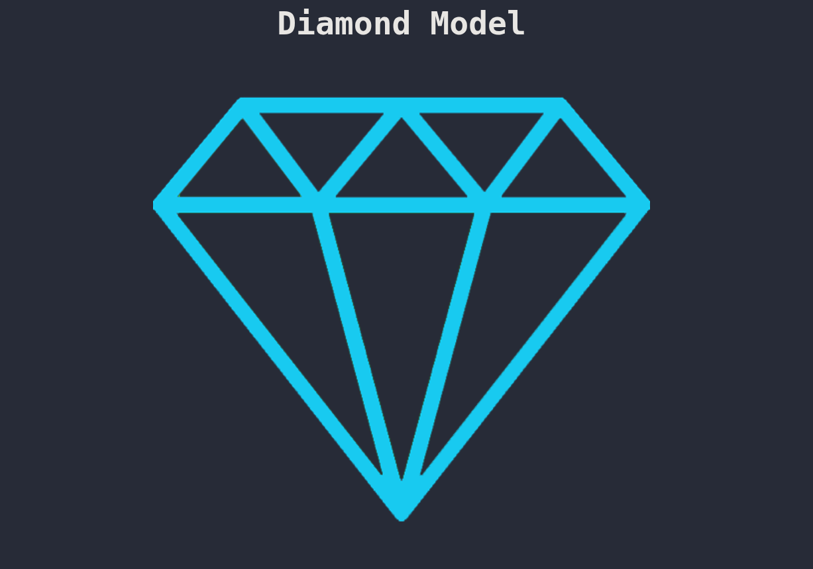
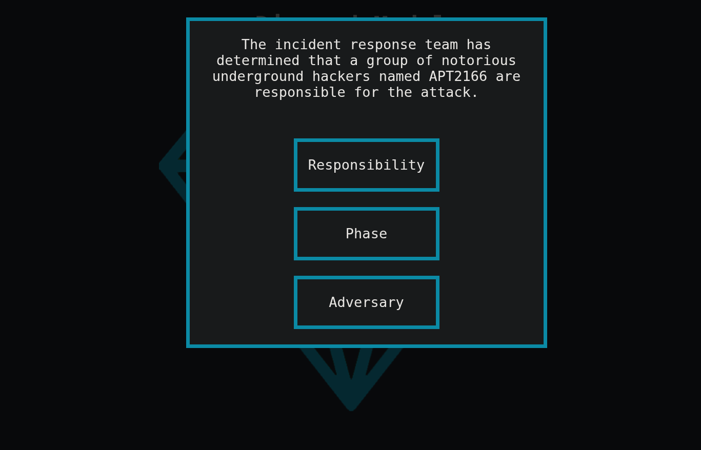
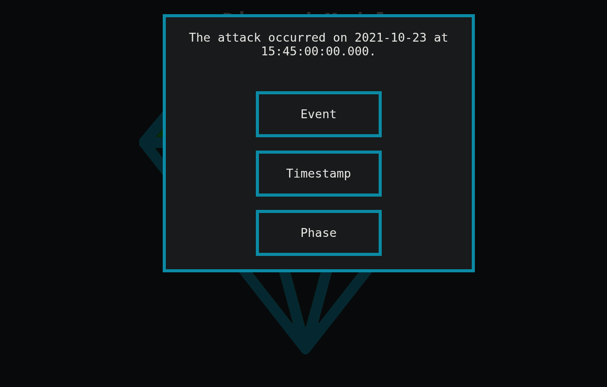
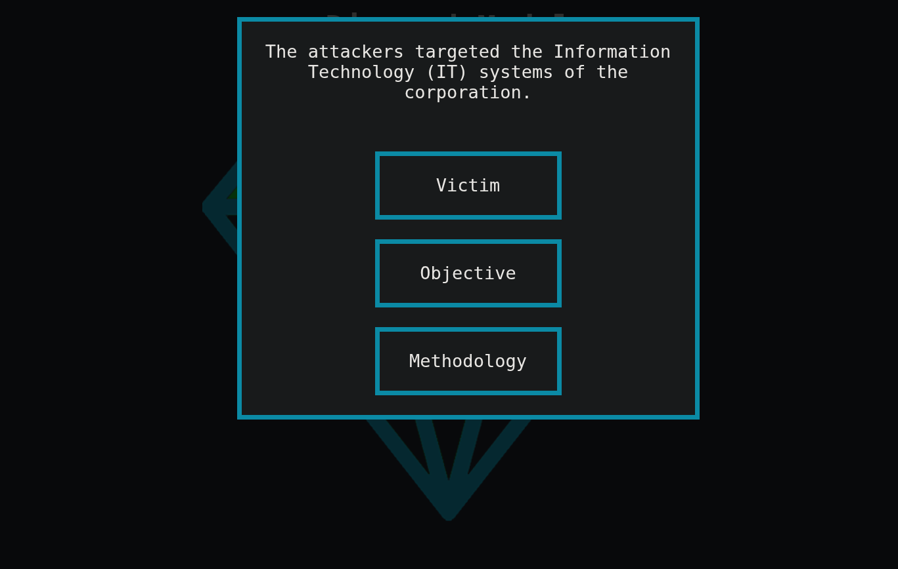
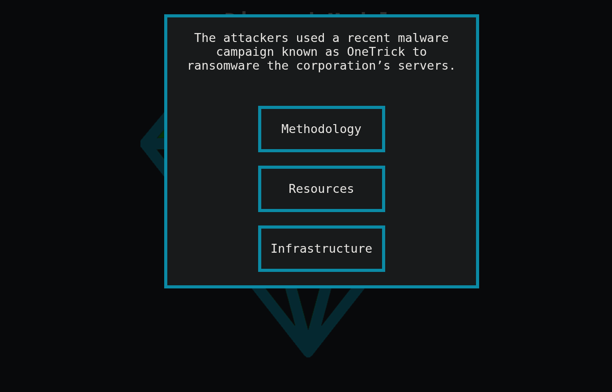
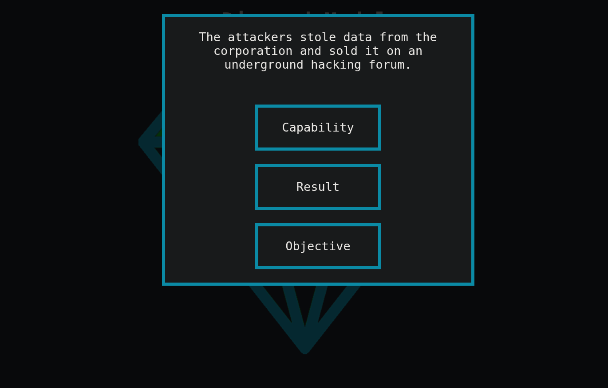
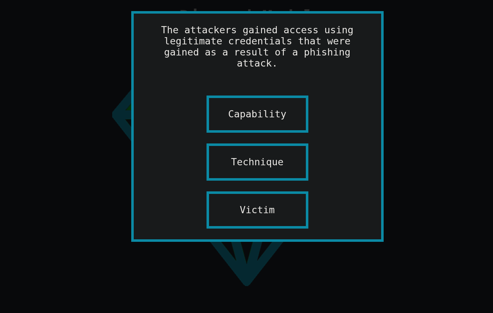
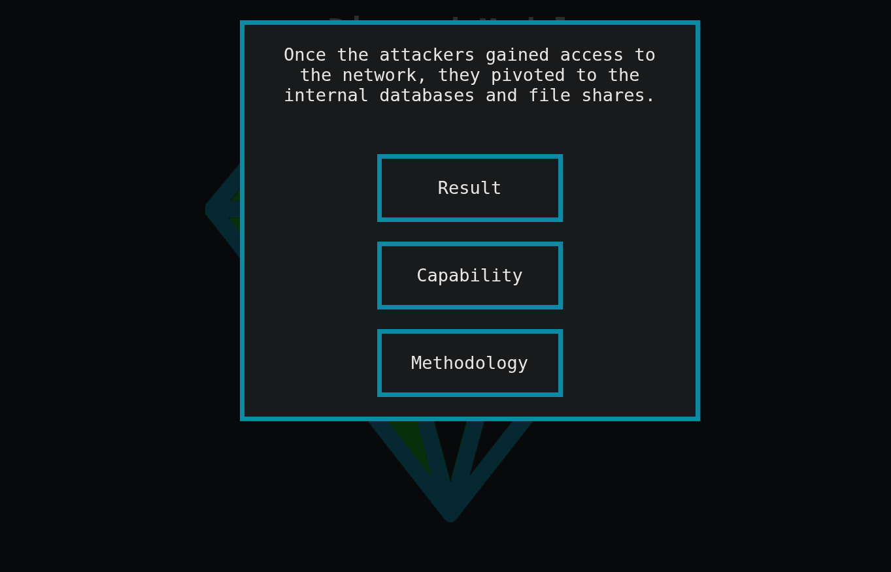
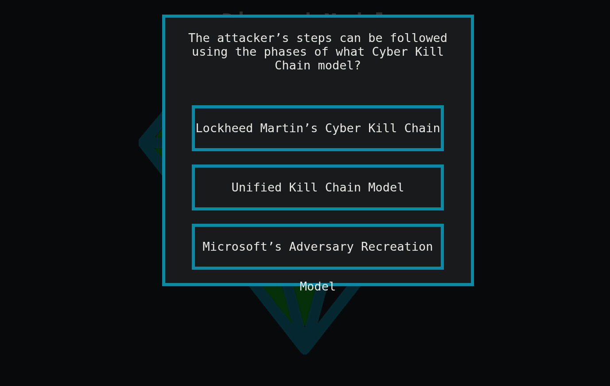
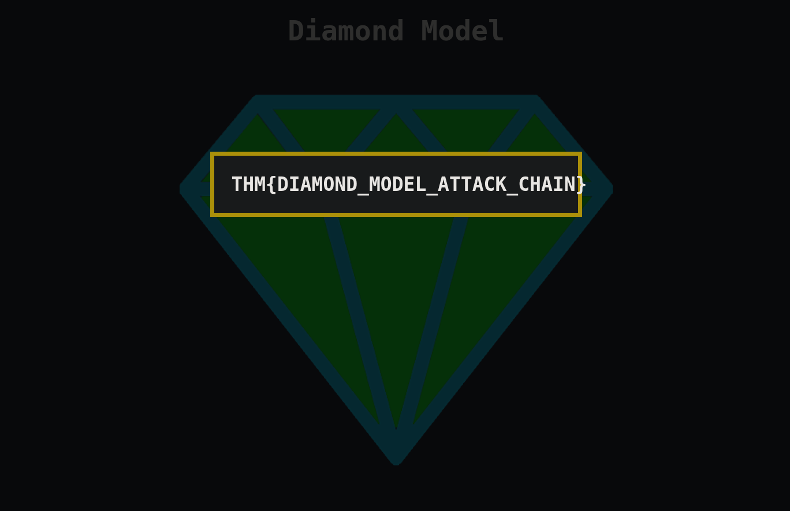

# Diamond Model — CTF Exercise

This write-up documents a CTF-style exercise based on the **Diamond Model of Intrusion Analysis**. The task required completing eight sections of the diamond by choosing the correct option for each prompt; correct answers light up the corresponding diamond segment.

---

## 🎮 What the CTF Is
A multiple-choice quiz where each correct selection fills one part of the diamond (Adversary, Victim, Capability, Infrastructure, etc.). The diamond turns green for each correct answer and awards a flag at completion.

---

## 📸 Screenshots & Progress
1. Starting view: the diamond with no questions answered.  
   

2. Question 1: I selected **Adversary** (correct).  
   

3. Question 2: I selected **Timestamp** (correct).  
   

4. Question 3: I selected **Victim** (correct).  
   

5. Question 4: I selected **Resources** (correct).  
   

6. Question 5: I selected **Result** (correct).  
   

7. Question 6: I selected **Capability** (correct).  
   

8. Question 7: I selected **Methodology** (correct).  
   

9. Question 8: I selected **Lockheed Martin Cyber Kill Chain** (correct).  
   

10. Final screen: Flag / success after completing the diamond.  
    

---

## 📝 What I Did
- Reviewed the study notes for the Diamond Model briefly before starting.  
- Went through each multiple-choice prompt and selected the option that best matched the diamond element described.  
- Observed the visual feedback (diamond segments lighting green) to confirm correct answers.

---

## 🔍 Observations & Notes
- The interaction model (select → segment lights) is an effective immediate-feedback learning tool.  
- Pre-reading the study material before attempting the quiz helped maintain accuracy across all questions and contributed to a clean run to the flag.  
- The Diamond Model’s components are more conceptual; this exercise reinforced the mapping between terminology (e.g., Adversary, Capability, Infrastructure) and practical examples.

---

## ✅ Outcome & Reflection
- Successfully completed the challenge and obtained the flag (see **CTF24.png**).  
- The quiz was a solid reinforcement of Diamond Model vocabulary and structure; useful for tabletop discussions or post-incident analysis, even if less directly actionable in live SOC detection workflows.

---

