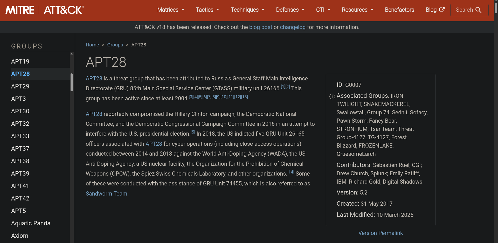
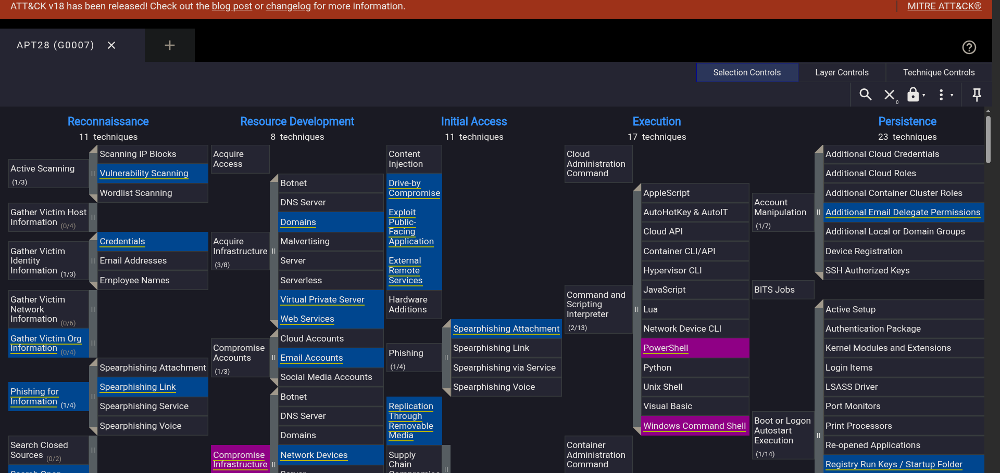
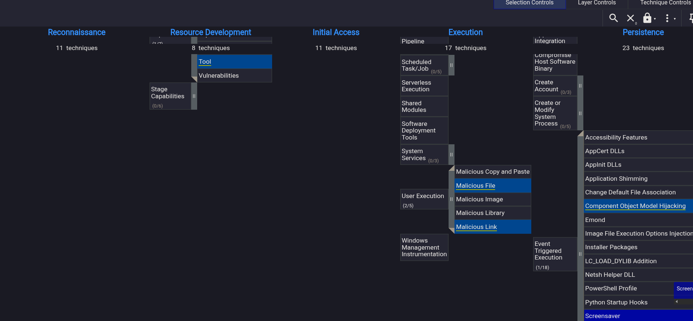
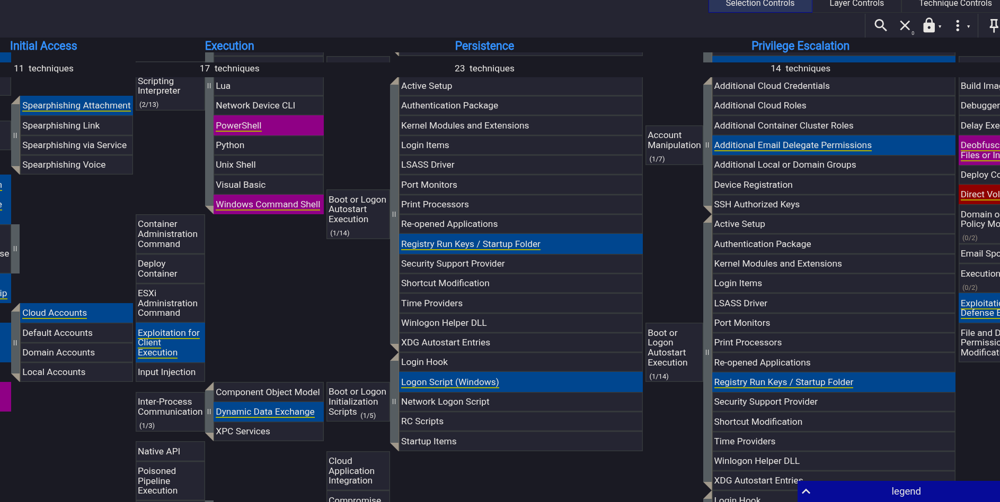
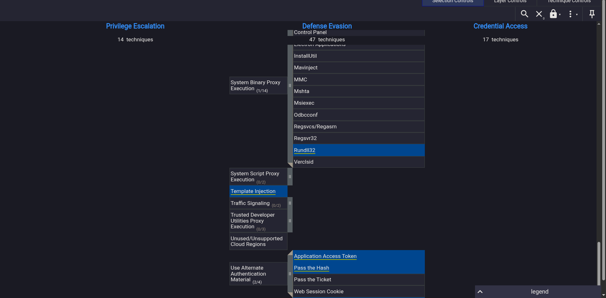
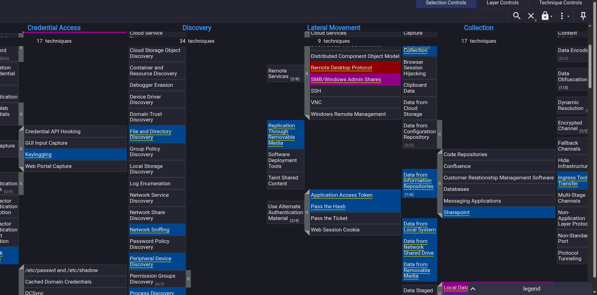
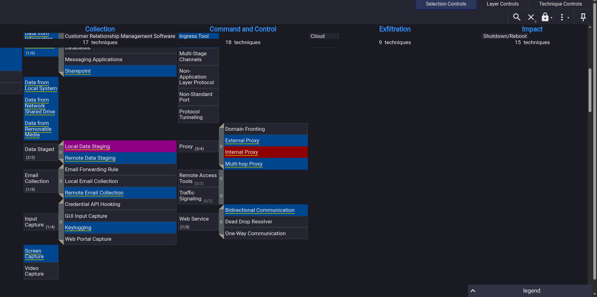

# Eviction — ATT&CK Navigator Threat Investigation

**Scenario:**  
Sunny is a SOC analyst at E-corp. A classified intelligence report indicates that **APT28** may attempt intrusions against organisations like E-corp. Using the MITRE ATT&CK Navigator, Sunny must identify TTPs used by the APT, check whether the group has intruded into the network, and stop it if so.

This write-up documents my investigative process, findings, and the answers I derived using the ATT&CK Navigator and related MITRE resources.

---

## 📌 Objective
Use the MITRE ATT&CK Navigator layer for APT28 to:
- Identify techniques that map to recon, initial access, execution, persistence, discovery, lateral movement, collection, and command & control.
- Answer a set of practical SOC questions about likely APT activity and telemetry to monitor.

---

## ✅ Final Answers (as required by the exercise)
1. **Technique used by the APT to both perform recon and gain initial access:**  
   **Spearphishing link**

2. **Which accounts might the APT compromise while developing resources?**  
   **Email accounts**

3. **Two user-execution techniques Sunny should look for:**  
   **Malicious file** and **Malicious link**

4. **Scripting interpreters to search for after user execution:**  
   **Powershell** and **Windows Command Shell**

5. **Registry keys to observe for persistence:**  
   **Registry run keys**

6. **System binary to scrutinize for proxy execution (defense evasion):**  
   **Rundll32**

7. **Discovery technique implied by finding tcpdump on a host:**  
   **Network sniffing**

8. **Remote services to observe for lateral movement traces:**  
   **SMB / Windows Admin shares**

9. **Likely target information repository for intellectual property collection:**  
   **SharePoint**

10. **Types of proxy used for exfiltration attempts:**  
    **external proxy** and **multi-hop proxy**

---

## 🔎 My Process (Step-by-Step)

1. **Search APT28 on MITRE** to locate the group page and Navigator layer.  
   

2. **Open the ATT&CK Navigator layer** for APT28 to inspect highlighted techniques by tactic.  
   For Q1, I checked Initial Access / Recon and matched the exercise format to **Spearphishing link**.  
   Because the room was old and mappings incomplete, I cross-referenced online sources.  
   

3. **Resource Development** showed **Email accounts** highlighted — matched Q2.  
   

4. **Execution** tactics showed **Malicious file** and **Malicious link**, answering Q3.  
   

5. **Command & Scripting Interpreter** section displayed **Powershell** and **Windows Command Shell** — Q4.  
   

6. **Persistence** section had **Registry Run Keys** — Q5.  
   

7. **Defense Evasion** included the binary **rundll32** — Q6.  
   

8. **Discovery** techniques like **Network sniffing** matched tcpdump usage — Q7.  
   

9. **Lateral Movement** and **Collection** included **SMB/Admin Shares** and **SharePoint** — Q8 and Q9.  
   

10. For **C2 and Exfiltration**, I looked under **Command & Control** and found **external proxy** and **multi-hop proxy** — Q10.  
    

---

## 🧠 Observations & Reflections

- **MITRE ATT&CK Navigator** makes it easy to visually map an adversary’s full kill chain, from Recon to C2.  
- **APT28** relies heavily on **email-based delivery** (spearphishing, malicious links/files) — a reminder to focus on mail gateway and endpoint telemetry.  
- **Defense Evasion** and **Persistence** via registry edits and native binaries (`rundll32`) highlight why defenders should baseline system binaries.  
- The **exercise structure mirrors real SOC workflows**: taking threat intel and mapping it to hunts.  
- Some data mappings were outdated, so verifying ATT&CK IDs and reading technique pages helps cross-check.

---

## 🔧 Tools & Resources Used
- **MITRE ATT&CK** (APT28 Group Page)  
- **MITRE ATT&CK Navigator** — for visual mapping  
- **Screenshots (E1–E7)** — evidence of each technique category  
- Supplemental online resources for older answer validation  

---

## 🔗 References
- MITRE ATT&CK: [https://attack.mitre.org](https://attack.mitre.org)  
- MITRE ATT&CK Navigator: [https://mitre-attack.github.io/attack-navigator/](https://mitre-attack.github.io/attack-navigator/)

---

**Reflection:**  
This exercise mirrors how SOC teams convert threat intel into action. By mapping APT28’s tactics and techniques, defenders can focus detection on high-likelihood behaviors like spearphishing, script-based execution, and C2 proxies. The ATT&CK Navigator visualization is invaluable for bridging theory and real-world detection planning.
