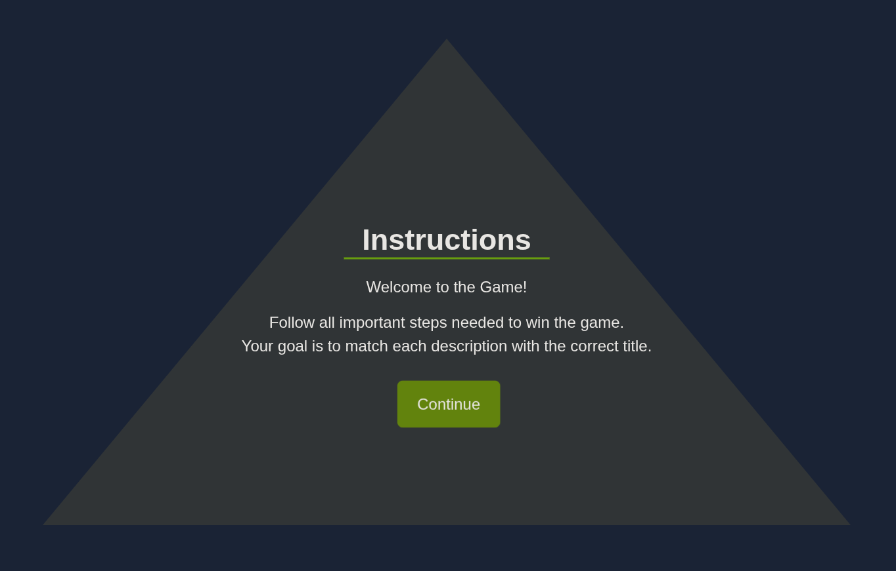
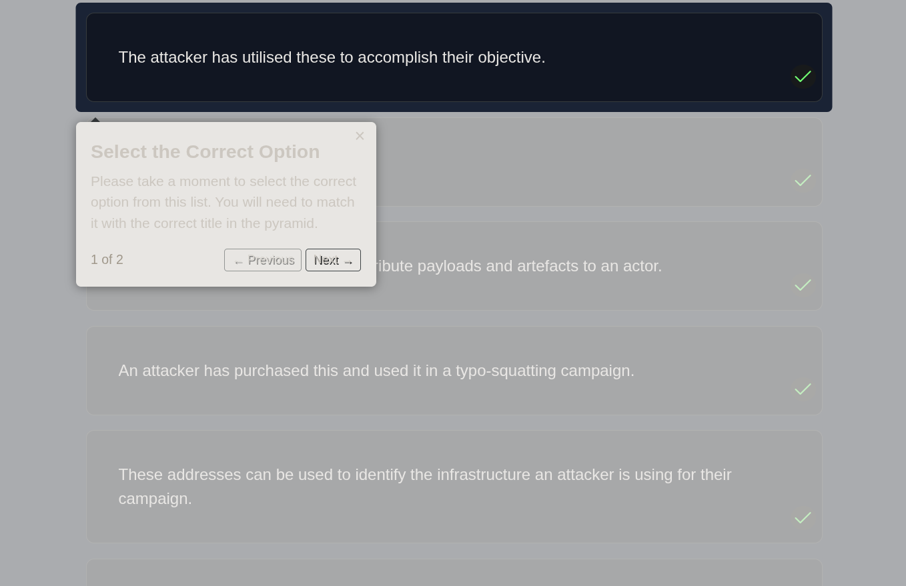
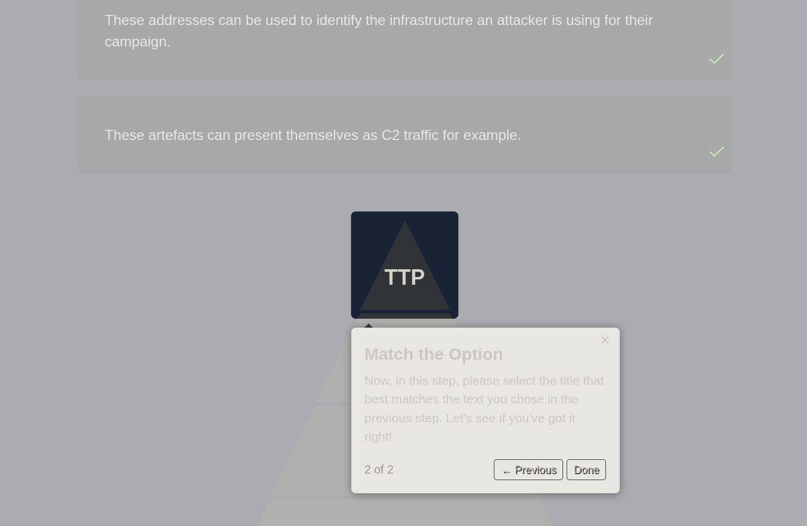
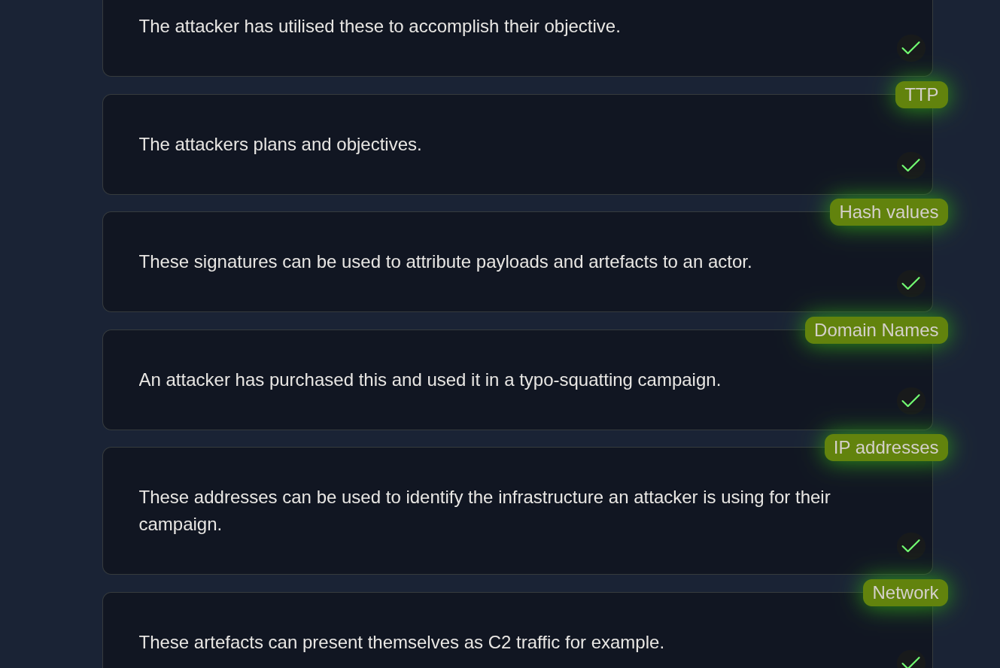
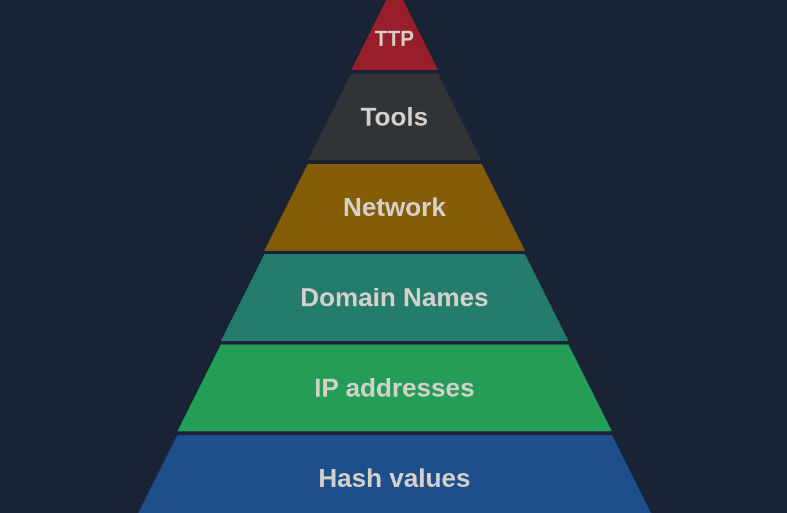
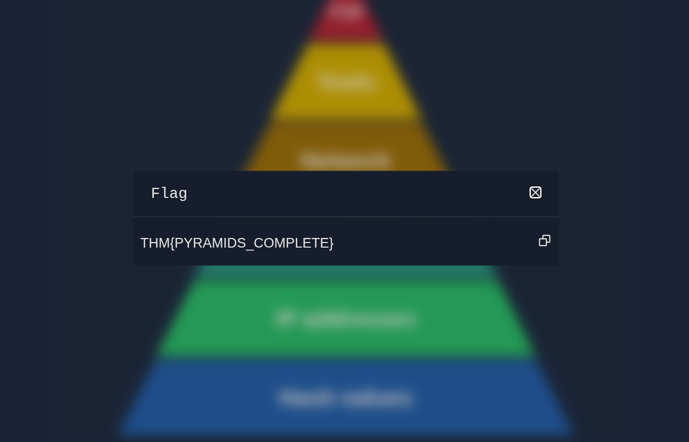

# Pyramid of Pain — CTF Exercise

This write-up documents a small interactive CTF-style exercise that tests knowledge of the **Pyramid of Pain** by asking the user to match sentences to the correct pyramid level.

---

## 🎮 What the CTF Is
The challenge is a matching game where you are presented with sentences (descriptions or indicators) and must select which **Pyramid of Pain** level they belong to. Correct matches light up the pyramid and progress you through the challenge until a flag is awarded.

---

## 📸 Screenshots
1. Overview: the challenge landing page and description of the game.  
   

2. Instruction screen part 1.  
   

3. Instruction screen part 2 (further details on scoring / selection).  
   

4. Example of sentences matched to pyramid categories (top-right shows match status).  
   

5. Pyramid lit up in various colors after selections to indicate correctness.  
   

6. Flag displayed after successfully completing the challenge.  
   

---

## 📝 What I Did
- Read the challenge description and instructions.  
- Attempted the matching exercise by assigning each sentence to a pyramid level.  
- Iterated through multiple attempts, observing which sentence types (hash, IP, TTP, tool, campaign) corresponded to each level.

---

## 🔍 Observations & Notes
- At first, I was **a bit confused** on how the game distinguished between certain sentences. Particularly where a sentence referenced a **tool** vs a **TTP-style description**.  
- I ran the challenge a couple of times and failed on early attempts while testing different selection approaches.  
- After re-reading the instruction hints and observing the pyramid feedback colors, I adjusted my reasoning (focus on whether the sentence described *specific artifacts* vs *behavior/TTP*) and successfully completed the challenge.

---

## ✅ Outcome & Reflection
- I eventually solved the challenge and obtained the flag (see **CTF6.png**).  
- The exercise was an excellent **practical reinforcement** of the Pyramid of Pain concepts: it forced me to quickly evaluate indicators and decide whether they represent low-level artifacts (hashes, IPs) or higher-level adversary behavior (tools, TTPs, campaigns).  
- It highlighted how *tool vs TTP* distinctions can be subtle and require careful reading which is a useful reminder for triage and classification tasks in real SOC workflows.

---
