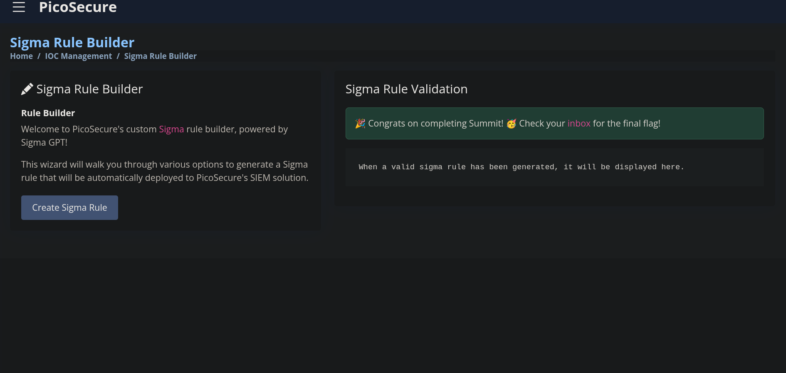

# Summit — Purple-Team / Detection Engineering CTF

**Objective:** Participate in an iterative purple-team simulation where a penetration tester (Sphinx) attempts to execute increasingly sophisticated malware on a simulated workstation while you configure detection and prevention controls. The goal is to increase the adversary’s cost of operations (Pyramid of Pain) and chase them away by blocking indicators and hardening telemetry.

This exercise emphasized iterative detection engineering: analyze malware reports, create/adjust controls (hash blocks, firewall rules, DNS filters, Sigma rules), and validate success via automated feedback (emails/flags).

---

## 📸 Starting Email & Sample (CTF25)
CTF25 shows the initial briefing email from Sphinx explaining the simulation and that they will start with `sample1.exe`.

---

## 🔎 Step 1 — Malware Sandbox Analysis & Hash Blocking (CTF26 → CTF27)
**What I did**
- Uploaded `sample1.exe` to the Malware Sandbox (Malware Box) and reviewed the **General Info** and **Behavior Analysis**.
- Noticed multiple file hashes; copied the **MD5** hash from the report.
- Navigated to the **Manage Hash** module and created a hash-blocking rule using the MD5 value.

**Screenshots**
- Malware analysis (hashes & behavioral summary):  
  

- Manage Hash — blocked MD5 hash and submitted rule:  
  

**Result**
- The system accepted the hash rule. After successful blocking I received a new email with **Flag 1** and the next sample attachment. (See next screenshot sequence.)

---

## 🔎 Step 2 — Network Indicators & Firewall Rule (CTF28 → CTF30)
**What I did**
- Uploaded the next sample to Malware Box. The analysis now included a **Network** section showing outbound HTTP requests and a suspicious IP address.
- Copied the malicious IP and created a firewall rule in the **Firewall Rule Manager** to block that IP.

**Screenshots**
- New email with flag and attachment:  
  

- Malware analysis network section (HTTP requests / IPs):  
  

- Firewall rule manager — created rule to block malicious IP:  
  

**Result**
- After rule application, the exercise progressed; I received **Flag 2** and the next sample.

---

## 🔎 Step 3 — DNS Indicators & DNS Filter (CTF31 → CTF33)
**What I did**
- Uploaded the next sample; analysis revealed suspicious DNS queries/domains in the **Network - DNS** section.
- Copied the suspicious domain and added a block rule in the **DNS Filter Module**.

**Screenshots**
- New sample / email:  
  

- Malware analysis: Network → DNS entries:  
  

- DNS Filter — rule created and success confirmed:  
  

**Result**
- Rule applied successfully; I received **Flag 3** and the next sample.

---

## 🔎 Step 4 — Registry Indicators & Sigma Rule (CTF34 → CTF36)
**What I did**
- Uploaded the next sample; a **Registry** section showed suspicious registry modification artifacts.
- Used the **Sigma Rule Builder** to create a detection rule:
  - Data source: **Sysmon Event Logs**  
  - Event type: **Registry modification**  
  - Matched registry key / name / value from the analysis  
  - Mapped to ATT&CK category: **TA0005 — Defense Evasion**

**Screenshots**
- New sample / email with attachments:  
  

- Malware analysis showing Registry artifacts:  
  

- Sigma Rule Builder — registry rule created & success:  
  

**Result**
- After deploying the Sigma rule, I received **Flag 4** and two new attachments.

---

## 🔎 Step 5 — Network Logs Analysis & Sigma (Size/Interval) (CTF37 → CTF39)
**What I did**
- One of the attachments (`outgoing connections.log`) contained many connections. I noticed a repeating pattern: the same byte size (97 bytes) every 30 minutes — likely a beacon to C2.
- Built a Sigma rule targeting Sysmon network events with:
  - Network size = 97 bytes  
  - Interval = 1800 seconds (30 minutes)  
  - Source/Destination IP set to `ANY` (attackers can rotate IPs)
- Deployed the Sigma rule.

**Screenshots**
- Email with attachments (including outgoing connections.log):  
  

- Outgoing connections log with repetitive pattern:  
  

- Sigma rule for network beacon (size/interval) created & success:  
  

**Result**
- Rule triggered/blocked pattern; received **Flag 5** and `commands.log`.

---

## 🔎 Step 6 — File Creation Detection & Final Sigma Rule (CTF40 → CTF42)
**What I did**
- Analyzed `commands.log` and found the malware would create a file `%temp%\exfiltr8.log` to stage exfil.
- Created a Sigma rule for **Sysmon File Create / Modify** events:
  - Path: `%temp%`  
  - File name: `exfiltr8.log`
- Deployed the rule and validated success.

**Screenshots**
- commands.log showing intended file creation:  
  

- Sigma rule for file creation (Sysmon) created & success:  
  

- Final email containing the last flag (Flag 6 / completion):  
  

**Result**
- Final rule deployment triggered the final flag. The simulation completed successfully with all flags captured.

---

## 🔍 Observations & Notes
- The exercise modeled an excellent **purple-team loop**: attacker increases sophistication; defender iterates detection and blocking.  
- Progression of indicators followed the **Pyramid of Pain** model — starting with simple file hashes and escalating to network, DNS, registry, periodic beacons, and file creation artifacts (each requiring progressively more robust detection).  
- Practical strengths:
  - Sandbox reports provided actionable telemetry (hashes, network, DNS, registry, command traces).  
  - Sigma rule abstraction allowed rapid translation of findings into SIEM-detectable rules.  
  - Blocking generic attributes (e.g., size+interval beacon) helps when adversaries rotate IPs/domains.
- Caution:
  - Some controls (hash blocks) are brittle — attackers can change binaries. Always prioritize higher-level detections (TTPs, behavior) where possible.
  - DEFEND/ATT&CK mappings accelerate detection design but be mindful that public mappings could reveal defensive posture if exposed.

---

## ✅ Key Takeaways / Lessons Learned
- Iterative detection engineering works — each successful control increases attacker cost and forces escalation.  
- Reliable detection often requires **behavioral rules** (beacon interval/size, file creation patterns, registry changes) rather than static IOCs (hashes/IPs).  
- Combining sandbox intelligence (file analysis) with SIEM rule construction (Sigma) is a practical workflow for SOC detection engineering.  
- This simulation reinforced how to **operationalize indicators** into SIEM rules, firewall/DNS policies, and endpoint controls.

---

## 🔧 Next Steps
- Convert the Sigma rules used here into production-ready rule sets (documentation for exceptions, tuning, testing against benign traffic).  
- Create a short lab documenting test alerts from each Sigma rule and steps to triage and validate true positives vs false positives.  
- Store sanitized example sandbox reports and Sigma rule JSON/YAML in an `examples/` folder for future reference.

---

**End of write-up — Summit CTF**
