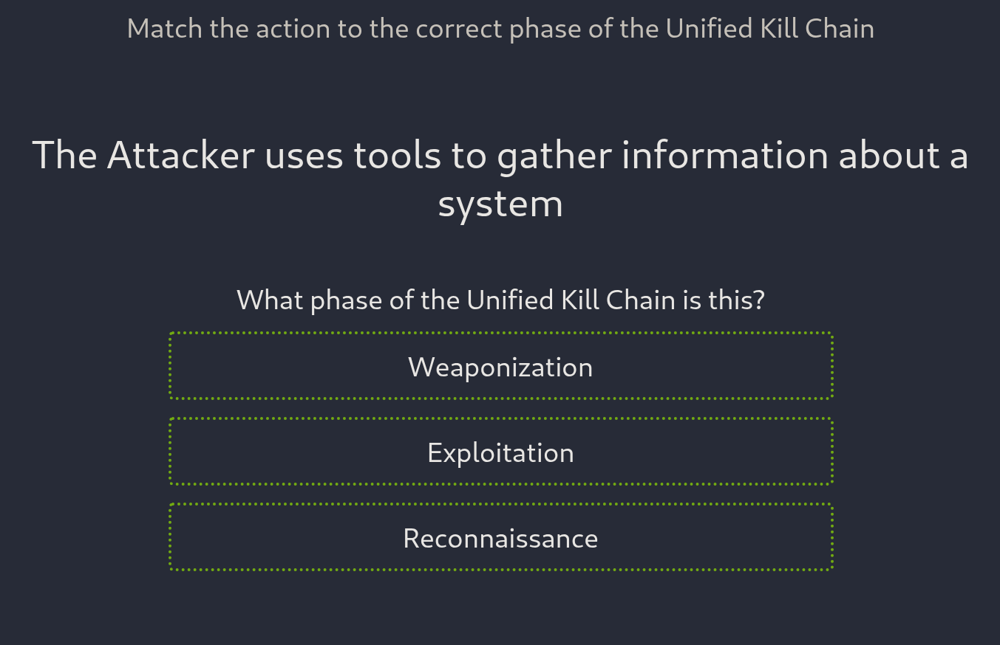
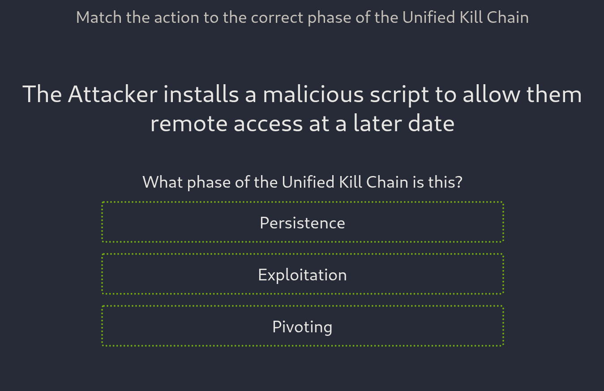
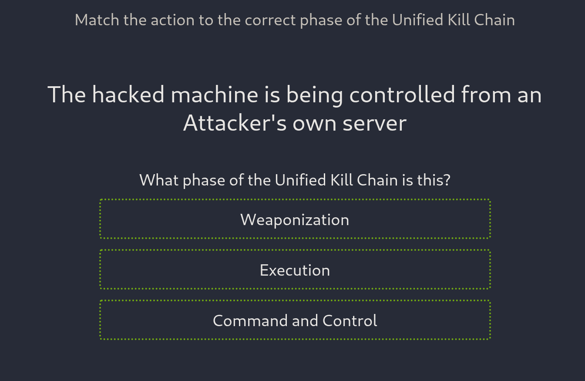
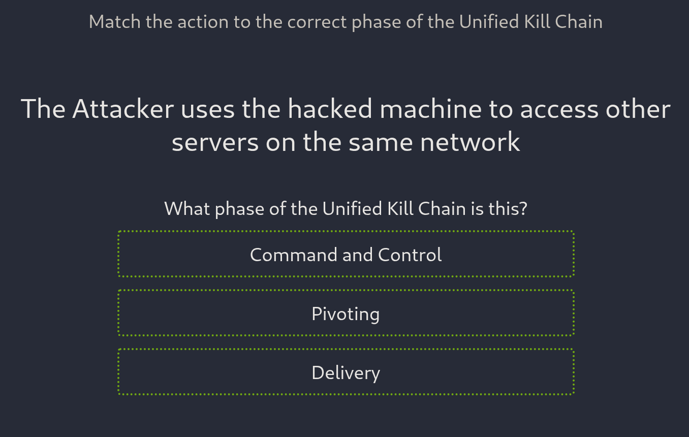
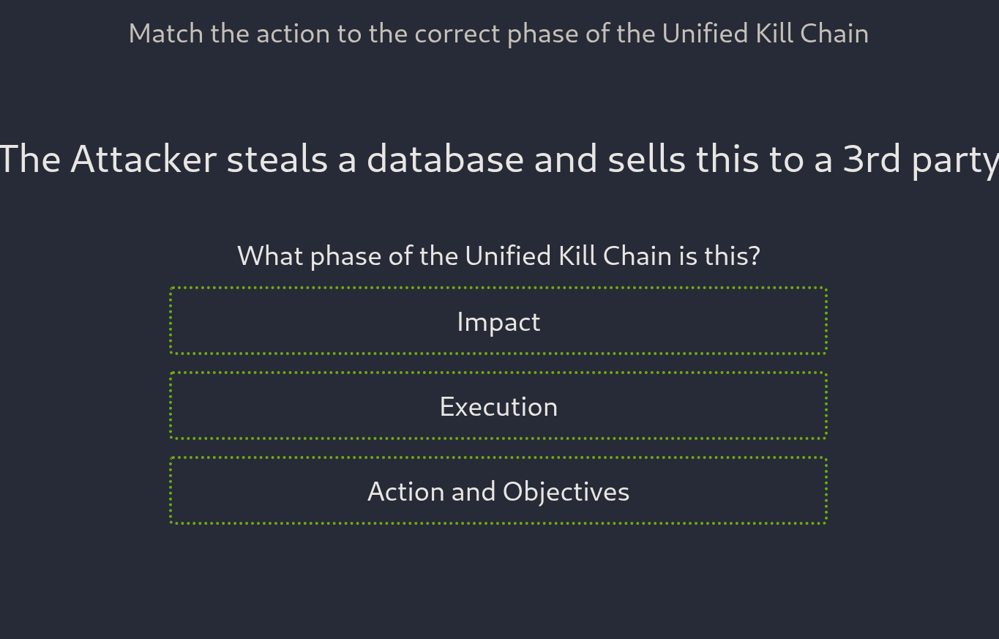

# Unified Kill Chain — CTF Exercise

This write-up documents a CTF-style quiz where I matched actions to the correct **Unified Kill Chain (UKC)** phases. The exercise tested quick recognition of which phase a given action belongs to.

---

## 🎯 What the CTF Is
A multiple-choice matching game: for each prompt, select the UKC phase that best fits the described action. Correct answers progress you toward the flag; consecutive correct answers contribute to a win streak.

---

## 📸 Screenshots & Answers
1. Question 1: I chose **Reconnaissance** (correct).  
   

2. Question 2: I chose **Persistence** (correct).  
   

3. Question 3: I chose **Command & Control** (correct).  
   

4. Question 4: I chose **Pivoting** (correct).  
   

5. Question 5: I chose **Actions on Objectives** (correct).  
   

6. Final screen: Flag / success.  
   

---

## 📝 What I Did
- Reviewed the prompt for each question and selected the UKC phase I believed matched the action.  
- Consulted study material beforehand to refresh concepts, which helped maintain accuracy across consecutive questions.

---

## 🔍 Observations & Notes
- The quiz reinforced how the UKC phases map to real attacker behaviors (recon → persistence → C2 → pivot → actions).  
- Consulting study notes before attempting helped build a **win streak**, demonstrating that quick review plus conceptual understanding improves performance in timed/quiz-style exercises.

---

## ✅ Outcome & Reflection
- Successfully answered all prompts and obtained the flag.  
- The exercise was a useful quick-check of UKC knowledge and highlighted the value of short refreshers before hands-on challenges or timed assessments.

---
