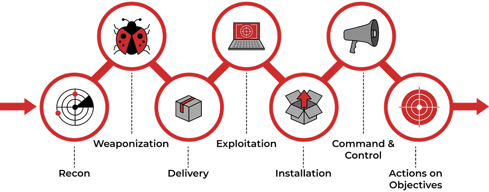

# 🛡️ Cyber Kill Chain

In my experience doing **Defensive Security CTFs** and general **SOC analysis in SIEM**, this framework is the most practical and useful to **map out an attacker’s movements** and identify points where defensive actions can be taken.  

The **Cyber Kill Chain** focuses on the **stages of an attack**, helping defenders understand how attackers progress and where to implement detection and mitigation.

---

## 🧩 Overview

The Cyber Kill Chain is a **step-by-step model of an attack**, originally developed by Lockheed Martin, that allows security teams to **analyze, detect, and prevent intrusions** systematically.  

It breaks down an attack into distinct stages, from initial reconnaissance to achieving the attacker’s objectives.

---

## 📊 Cyber Kill Chain Diagram

*Image source: [Haircutfish - TryHackMe Cyber Kill Chain Room](https://medium.com/@haircutfish/tryhackme-cyber-kill-chain-room-a0ebcff024a9)*

---

## 🔍 The Seven Stages

| Stage | Description | Defensive Focus |
|-------|-------------|----------------|
| 1 | **Reconnaissance** – Attacker gathers information about the target | Threat intelligence, log monitoring |
| 2 | **Weaponization** – Creating the attack payload | Malware analysis, sandboxing |
| 3 | **Delivery** – Sending the payload (email, USB, web) | Email filtering, network monitoring |
| 4 | **Exploitation** – Triggering the vulnerability | Patch management, endpoint protection |
| 5 | **Installation** – Installing malware on the target system | Endpoint detection, SIEM alerts |
| 6 | **Command & Control (C2)** – Establishing remote control | Network monitoring, firewall rules |
| 7 | **Actions on Objectives** – Achieving the attacker’s goals | Incident response, containment, mitigation |

---

## 💡 Key Takeaways

- The Cyber Kill Chain is **highly practical for SOC analysts**, providing a structured way to anticipate and detect attacks.  
- Mapping attacker activity against each stage allows defenders to **identify gaps and prioritize security measures**.  
- It is an essential framework for **incident response, SIEM monitoring, and threat hunting**.  

---

## 🧠 Reflection

Working with this framework during **Defensive Security CTFs** has helped me understand how attacks unfold in the real world, and how **security tools like SIEM and endpoint monitoring** fit into each stage.  
It’s a hands-on way to connect **theory with practice**, making it one of my favorite frameworks to study and document.

---

*Tools/Platforms used while learning:*  
- TryHackMe Cyber Kill Chain Room  
- SIEM practice (Splunk / Elastic / Log aggregation labs)  
- Lab VMs and packet capture exercises
