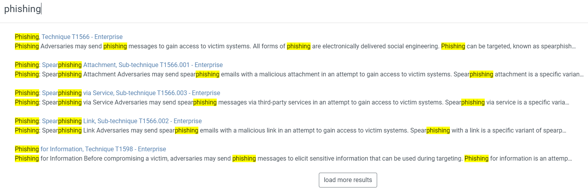
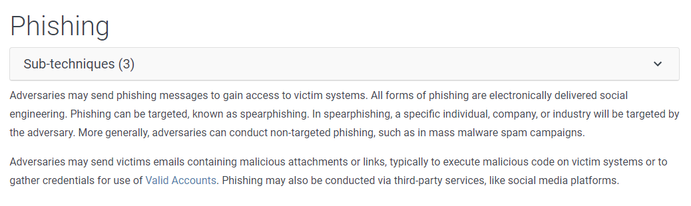
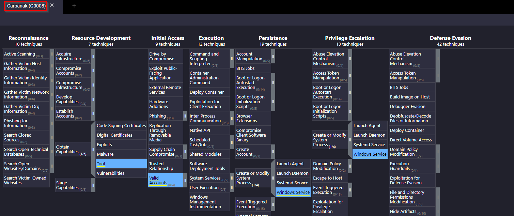

# MITRE ATT&CK

The **ATT&CK** framework is a curated knowledge base of adversary **Tactics, Techniques, and Procedures (TTPs)**.  
I used ATT&CK extensively to research APT groups, identify common tools and techniques, and build Navigator maps that supported both CTF challenges and defensive planning.

---

## 🧭 Overview
ATT&CK provides a structured vocabulary for describing adversary behavior and mapping observable telemetry to known techniques.  
It is effective for threat hunting, red-team planning, and validating detection coverage.

---

## 🛠 Practical — 1: Technique Lookup (Phishing)
To demonstrate practical use of ATT&CK, I searched the **Phishing** technique and examined historical usage and references.

**What I did**
- Used the ATT&CK website/console to search the technique entry for *Phishing*.
- Reviewed the examples, mitigations, and the list of groups and software instances that have used this technique.

**What I observed**
- The technique entry clearly lists examples, mitigations, and groups that have leveraged phishing in campaigns — useful for both red-team emulation and blue-team detection prioritisation.

**Screenshots**

*(Images show the technique entry and associated groups/references as seen in ATT&CK.)*

---

## 🛠 Practical — 2: Group Mapping with ATT&CK Navigator (Carbanak G0008)
Next, I used **ATT&CK Navigator** to explore the profile of the *Carbanak G0008* (example APT) and inspect which techniques it commonly uses.

**What I did**
- Loaded or located the Carbanak (G0008) layer in ATT&CK Navigator.  
- Inspected technique coverage across tactic categories and filtered/personalised the view to highlight the most relevant techniques for the group.

**What I observed**
- The Navigator layer highlighted techniques across multiple tactic categories. For example:
  - **Initial Access:** techniques such as *Valid Accounts* appeared for initial access in the layer.  
  - **Privilege Escalation:** techniques like *Windows Service* were visible under privilege escalation for this group.
- The Navigator filtering/toolbar made it straightforward to focus on certain tactics, change color scoring, and export or save the layer for later use.

**Screenshots**

*(Images show the Navigator layer for Carbanak and the Navigator UI where filters and layer controls are applied.)*

---

## 🔎 What I Learned
- How to **search ATT&CK** for techniques and see which groups and software have used them, which helps inform both detection rules and red-team emulation.  
- How to use **ATT&CK Navigator** to visualise group technique coverage and to filter/personalise layers for focused analysis.  
- How to convert ATT&CK mappings into **hypotheses** for detection and hunting.

---

## 🛠 Practical Applications
- **CTFs / Red Teaming:** Selected realistic TTPs from ATT&CK to model adversary emulation during challenges.  
- **Threat Hunting:** Mapped suspicious alerts to ATT&CK techniques to prioritise which telemetry to investigate first.  
- **Detection Planning:** Used Navigator layers to identify technique coverage gaps and inform what telemetry or logging to collect.  
- **Playbook Development:** Translated ATT&CK techniques into SIEM queries and stepwise investigation/checklists.

---

## 📌 Key Takeaways
- ATT&CK is the go-to reference for translating raw telemetry into meaningful adversary behavior.  
- Building Navigator layers accelerates both offensive scenario design and defensive gap analysis.  
- Pairing ATT&CK with DEFEND (controls) helps turn detection hypotheses into concrete defensive actions.

---

## 🔧 Tools & Resources Used
- **ATT&CK Navigator** — created technique layers and coverage maps  
- **MITRE ATT&CK website** — canonical technique and group references  
- **TryHackMe / CTFs** — practiced mapping observed activity to ATT&CK techniques  
- **SIEM (Splunk / ELK)** — implemented searches based on ATT&CK-derived hypotheses

---

