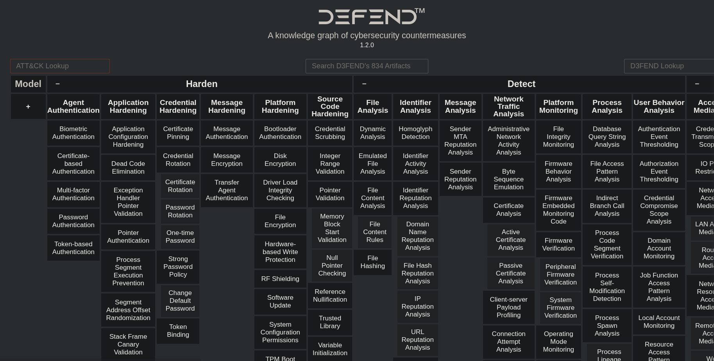
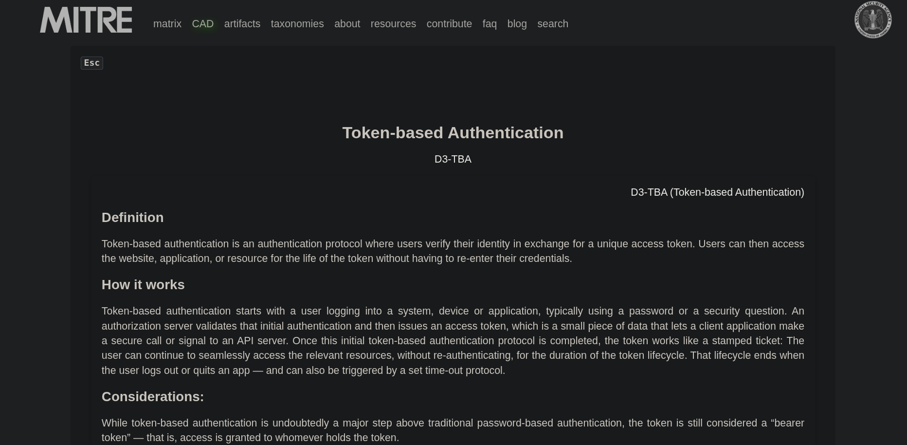

# MITRE DEFEND

**DEFEND** is MITRE’s defensive complement to ATT&CK where it focuses on **controls and mitigations** that defenders can implement to detect, deny, disrupt, degrade, or deceive adversary activity. It is explicitly designed with blue-team use cases in mind.

---

## 🧭 Overview
DEFEND translates ATT&CK techniques into **practical defensive guidance**, helping defenders choose controls and detection strategies that map to specific adversary behaviors. It’s useful for designing coverage, constructing playbooks, and prioritizing defensive investments.

---

## 🛠 Practical — DEFEND Matrix Exploration

To demonstrate practical use of DEFEND, I reviewed the DEFEND matrix and explored the defensive categories and techniques it recommends.

**What I did**
- Opened the DEFEND matrix to inspect high-level categories such as **Harden, Detect, Isolate, Deceive, Evict,** and **Restore**.  
- Selected a specific Harden technique, **Token-based Authentication**, to review its controls and implementation guidance.

**Screenshots**
  
*(Shows DEFEND categories and the layout of techniques under each category.)*

  
*(Shows the DEFEND page for the Harden → Token-based Authentication technique.)*

**What I observed**
- The matrix clearly groups defensive actions by outcome (e.g., Harden vs Detect), making it straightforward to map controls to ATT&CK techniques.  
- The detail page for **Token-based Authentication** includes practical guidance that can be translated into SIEM checks, configuration hardening, and control validation tests.

**Reflection / Caution**
- While DEFEND is extremely useful for defenders by helping convert threat intelligence into concrete controls—the same clarity can be **leveraged by attackers** to discover which defenses an organisation might reasonably implement.  
- For that reason, it’s important to treat DEFEND mappings as a **planning and internal design tool**, and avoid exposing detailed control mappings or playbooks publicly without appropriate context or access controls.

---

## 🛠 Applications of the DEFEND Framework
- **Control Mapping:** Use DEFEND to map existing SIEM alerts and endpoint protections to ATT&CK techniques, identifying where controls are missing.  
- **Playbook Design:** Translate DEFEND guidance into step-by-step playbook actions (what to monitor, how to contain, and which controls to apply).  
- **Detection Validation:** Design tests (red-team/CTF style) to validate that DEFEND-prescribed controls actually generate detectable telemetry.  
- **Deception:** Implement decoy files or honeytokens to create early detection opportunities for credential theft or lateral movement.

---

## 🔎 What I Learned
- DEFEND provides a clear mapping from **ATT&CK techniques** to **defensive controls** (detect, deny, disrupt, degrade, deceive).  
- The framework is intentionally practical for blue teams because it helps convert threat intelligence into measurable defensive actions.  
- Example concept explored: **Decoy Files** using deceptive or honeyfiles to detect lateral movement and data access attempts.
- Example concept explored: **Token-Based** using token to increase the strength of Authentication process.

---

## 📌 Key Takeaways
- DEFEND is highly actionable for blue teams because it reduces the gap between intel (ATT&CK) and operational security controls.  
- Pairing **ATT&CK (what adversaries do)** with **DEFEND (what defenders should do)** creates a powerful cycle of identify → protect → validate.  
- Small, targeted controls (like decoy files or specific logging rules) can offer high defensive value when mapped correctly.

---

## 🔧 Tools & Resources Used
- **DEFEND documentation (MITRE)** — primary mapping resource  
- **SIEM platforms (Splunk / ELK)** — implementing detection rules informed by DEFEND  
- **Deception tools / honeytokens** — lab testing for decoy file detection  
- **ATT&CK Navigator** — cross-referencing ATT&CK techniques with DEFEND controls

---
