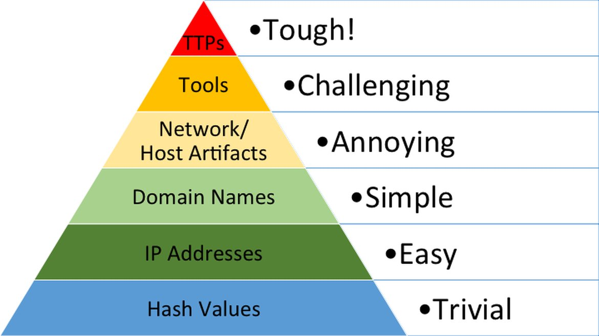

# 🧱 Pyramid of Pain

I had the most fun learning this framework because it’s inherently different from the traditional kill chains.  
While kill chain models focus on **the stages of an attack**, the **Pyramid of Pain** emphasizes **how much it disrupts an attacker when defenders remove or modify specific indicators**.

---

## 🧩 Overview

The Pyramid of Pain is divided into **seven levels**, each representing a type of **Indicator of Compromise (IOC)**.  
As you move **up the pyramid**, the **impact on the attacker increases**—it becomes harder for them to continue their operations without re-engineering tools or tactics.

---

## 📊 Pyramid of Pain Diagram

---

## 🔍 The Seven Levels

| Level | Indicator Type | Description | Difficulty for Adversary |
|-------|----------------|--------------|---------------------------|
| 1 | **Hash Values** | Specific file signatures; easy to change. | 🟢 Low |
| 2 | **IP Addresses** | Often short-lived and can be swapped. | 🟢 Low |
| 3 | **Domain Names** | Require registration and setup but are replaceable. | 🟠 Moderate |
| 4 | **Network/Host Artifacts** | Unique traits like registry keys, services, or traffic patterns. | 🟠 Moderate |
| 5 | **Tools** | Software or scripts used for attacks (e.g., Cobalt Strike). | 🔴 High |
| 6 | **Tactics, Techniques, and Procedures (TTPs)** | Core adversary behavior and tradecraft. | 🔴 Very High |
| 7 | **Campaigns** | The overall coordinated operation or goal. | 🔴 Very High |

---

## 💡 Key Takeaways

- The higher you go up the pyramid, the **greater the impact** on an attacker when you detect or block those indicators.  
- Defensive teams should aim to disrupt **TTPs and tools**, not just hashes or IPs.  
- This framework helps prioritize **defensive actions based on their real-world effect** on adversaries.

---

## 🧠 Reflection

Learning this framework helped me understand how **cyber defense isn’t just about detection—it’s about disruption**.  
It’s a mindset shift: instead of reacting to every alert, it’s about strategically **targeting what hurts attackers the most**.

---

*Tools/Platforms used while learning:*  
- TryHackMe (Pyramid of Pain Room)  
- Visual notes with draw.io and Obsidian for concept mapping  

---
