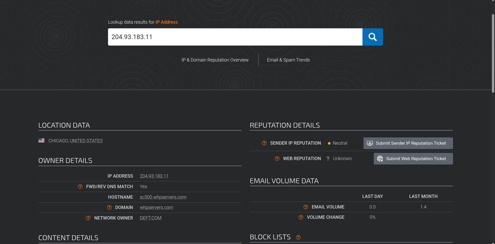
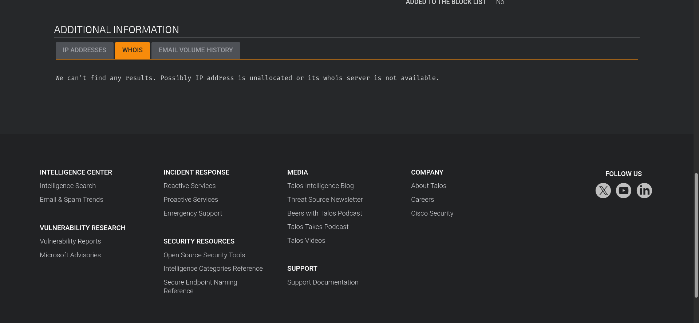
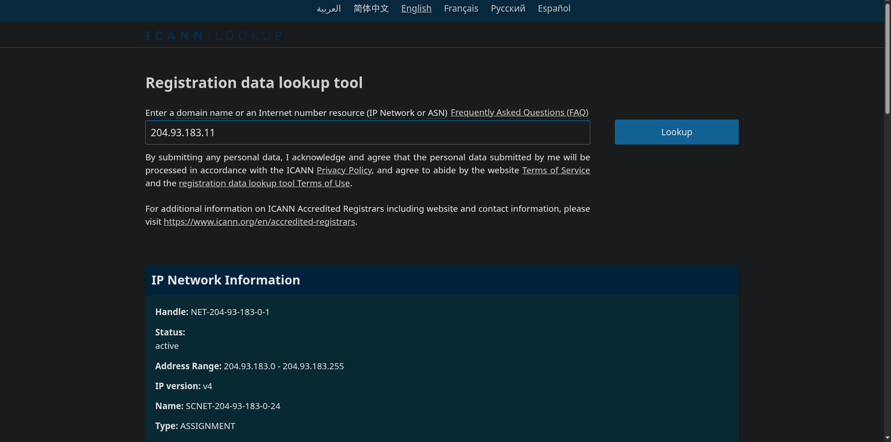

# Part 2 — IP Enrichment with Cisco Talos (CTI-Chain-Project)

This is the **second part of the CTI-Chain-Project**. In this exercise I enriched the defanged IP from Part 1 (`204[.]93[.]183[.]11`) using **Cisco Talos Intelligence** and other OSINT sources to find domain and customer details.

---

## ✅ Questions & Correct Answers

1. **What is the listed domain of the IP address from the previous task?**  
   **Answer:** `scnet.net`

2. **What is the customer name of the IP address?**  
   **Answer:** `Complete Web Reviews`

---

## 🧭 My Process / Journey

1. I started at the **Cisco Talos** reputation lookup page and entered the raw IP address `204.93.183.11` to see what Talos reported.  
   

2. Talos returned useful telemetry about the IP, but the **domain name it showed did not match** the expected answer in the TryHackMe room. I spent about 20 minutes troubleshooting by checking different tabs and historical views on Talos but I still couldn’t reconcile the difference. Because the room is older, some expected answers were mapped differently. I documented this in my notes.  
   

3. To confirm the **customer/owner information**, I used an independent WHOIS-like lookup (ICANN/WhoIs) to cross-check registration and ownership details. That search surfaced **Complete Web Reviews** as the customer name associated with that IP or range. I captured the relevant output for reference.  
   

4. I was able to find the answer after scrolling down abit to the Contact Information Section.
   

---

## 📝 Notes & Remarks

- Talos is a strong CTI resource, but platform views and mapped answers in older training rooms can sometimes diverge from current data. When that happens, it’s good practice to corroborate with **multiple sources** (e.g., WHOIS, RIPE/ARIN, VirusTotal, Writeups) which is what I did here.  
- I logged both Talos outputs and the independent WHOIS lookup to make sure my enrichment was defensible and reproducible.

---

## 🔎 Lessons Learned

- Always cross-check Talos findings with other OSINT sources when lab answers don't match live platform data.  
- Training rooms can become stale; treat lab "expected answers" as guides but validate with current, authoritative sources.  
- Document the tools and exact queries you used so you can reproduce results in interviews or incident reports.

---

