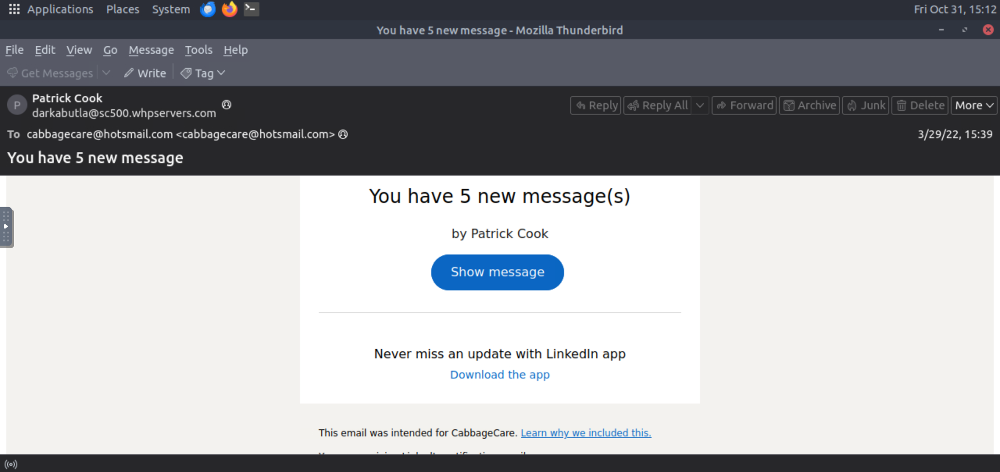
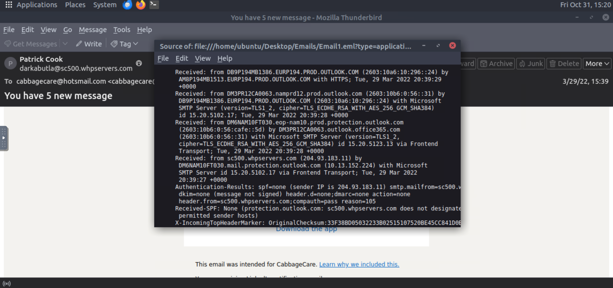

# Part 1 — Phishing Analysis (CTI-Chain-Project)

This document is the **first part of the CTI-Chain-Project** which is a small investigation chain that documents how I collect, analyse, and escalate threat intelligence from an initial phishing email through to enrichment and reporting.

# 🕵️‍♀️ Phishing-Analysis(Part 1) — Email Analysis Exercise

A short hands-on exercise/CTF from TryHackMe to practise email forensics and phishing triage. I analysed a provided `.eml` sample and answered four questions about the sender, recipient, originating IP, and the email’s path.

---

## ✅ Questions & Correct Answers

1. **What social media platform is the attacker trying to pose as in the email?**  
   **Answer:** LinkedIn

2. **What is the sender's email address?**  
   **Answer:** darkabutla@sc500.whpservers.com

3. **What is the originating IP address? (defanged)**  
   **Answer:** 204[.]93[.]183[.]11

4. **How many hops did the email go through to get to the recipient?**  
   **Answer:** 4

---

## 🧭 My Process / Journey

1. I started the lab VM and opened the email folder. I loaded **Email1.eml** into Thunderbird Mail to examine the message visually and inspect headers.  
   

2. To answer **Question 1** (which platform the attacker was impersonating) I scrolled through the email body and noticed a **LinkedIn** footer and branding which immediately gave me the answer.

3. **Questions 2 and 3** (sender and recipient addresses) were visible near the top of the message in Thunderbird’s UI, so I captured those directly from the first screenshot.

4. For the **originating IP**, I wanted a precise and robust method rather than guessing. I inspected the **raw message source / headers** in Thunderbird to find the relevant `Authentication-Results` / `Received` headers and identified the IP of interest. (See the header view below.)  
   

5. I used CyberChef to **defang** the IP (replace dots with `[.]`) to safely present it in reports: **204[.]93[.]183[.]11**. The defanging step is shown here.  
   

6. To determine the **number of hops**, I counted the `Received:` header lines in the raw source and there were **4** hops between the origin and the recipient (also visible in the header screenshot).

---

## 📝 Lessons Learned

- Thunderbird’s **raw source / header view** is invaluable for forensic email work — it stores the traversal path and revealing metadata that isn’t displayed in the normal message pane.  
- Always **defang indicators** (IPs, domains) before sharing in public reports. I used CyberChef for quick and repeatable defanging.  
- Counting `Received:` headers is a simple, reliable method to estimate message hops (bearing in mind forwarded/relay behaviour can affect interpretation).

---
