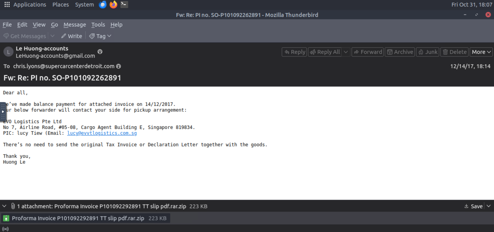
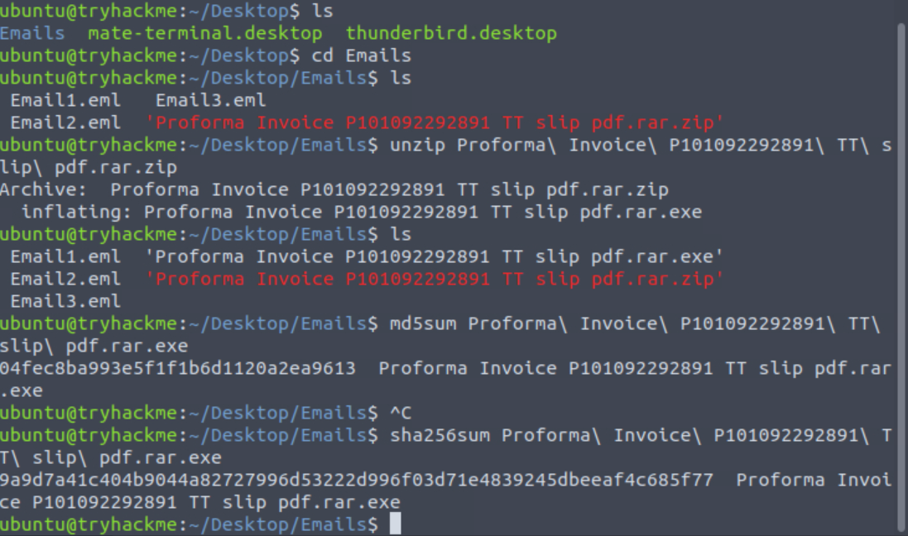
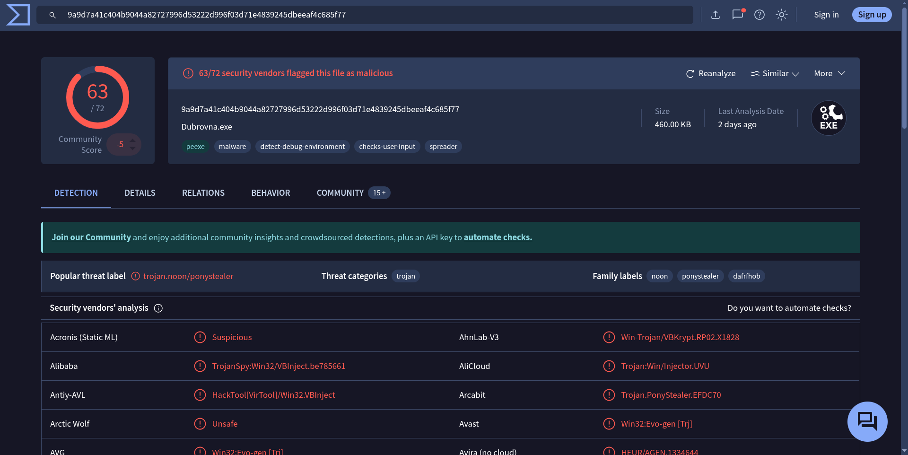
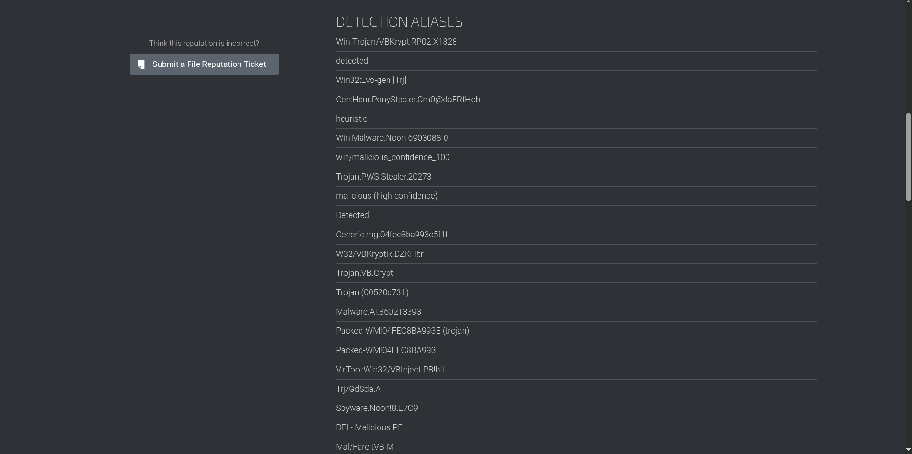

# Part 3 — Scenario 1 (CTI-Chain-Project)

Scenario: You are a SOC Analyst. Several suspicious emails have been forwarded to you from other coworkers. You must obtain details from each email to triage the incidents reported. 

This is the third part of the **CTI-Chain-Project**. In this exercise I triaged a suspicious email (`Email2.eml`) from the lab VM, extracted key artifacts, and used external services to enrich and validate findings.

---

## ✅ Questions & Correct Answers

1. **According to Email2.eml, what is the recipient's email address?**  
   **Answer:** `chris.lyons@supercarcenterdetroit.com`

2. **On VirusTotal, the attached file can also be identified by a Detection Alias, which starts with an H.**  
   **Answer:** `HIDDENEXT/Worm.Gen`

---

## 🧭 My Process / Journey

1. I opened the VM and loaded **Email2.eml** into Thunderbird to inspect the message and headers. The recipient address (`chris.lyons@supercarcenterdetroit.com`) was visible in the header view.  
   

2. I downloaded the attachment from the email and unzipped it to obtain the binary. To create reliable artefacts for lookup, I generated file hashes (MD5 and SHA256) and saved the output for reference.  
   

3. Using the hashes, I searched VirusTotal to find detection names and aliases. Initially I could not locate the expected detection alias there (screenshot shows the search/output).  
   

4. I also checked Cisco Talos Intelligence for corroborating telemetry and reputation data, but that did not surface the alias either (screenshot of Talos lookup).  
   

5. After cross-checking and spending time on the above sources, I reached out to the TryHackMe room maintainers. They confirmed the lab content contained an error and supplied the expected detection alias `HIDDENEXT/Worm.Gen`.

---

## 📝 Notes & Reflections

- Thunderbird is a reliable starting point for email triage where areas such as headers and attachments are easy to access and export.  
- Generating hashes (MD5, SHA256) is essential for consistent lookups across CTI platforms.  
- When lab answers don’t match live tooling, it’s important to corroborate with multiple sources (VirusTotal, Talos, WHOIS) and, if needed, contact the lab maintainers because training content can become outdated or contain mistakes.  
- Documenting each query and screenshot made reproducing results easier and helped justify the steps I took.

---

