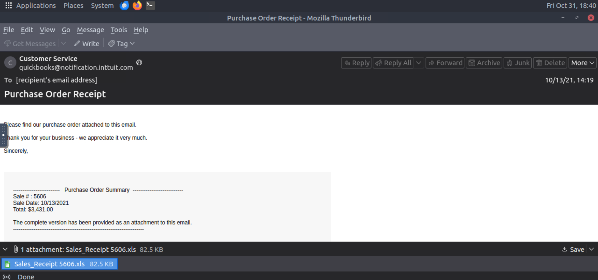
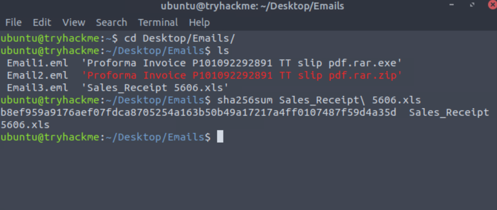
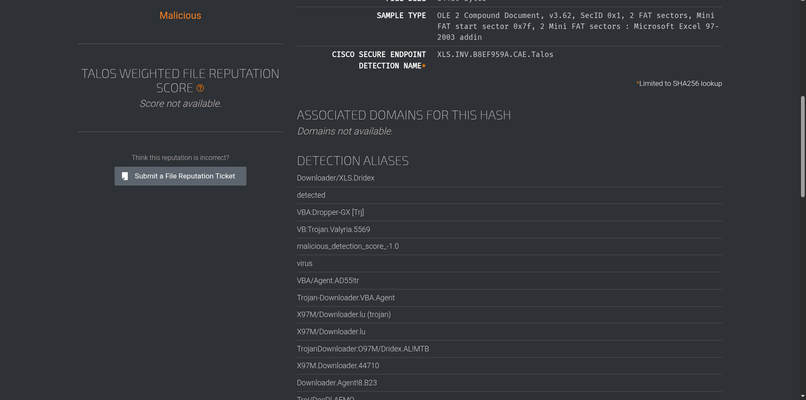

# Part 4 — Scenario 2 (CTI-Chain-Project)

Scenario: You are a SOC Analyst. Several suspicious emails have been forwarded to you from other coworkers. You must obtain details from each email to triage the incidents reported. 

This is the **final part** of the **CTI-Chain-Project**, where I analyzed another suspicious email (`Email3.eml`) to identify the attachment and determine the associated malware family. This task was very similar to Part 3, but this time, I successfully found the correct answers on my own.

---

## ✅ Questions & Correct Answers

1. **What is the name of the attachment on Email3.eml?**  
   **Answer:** `Sales_Receipt 5606.xls`

2. **What malware family is associated with the attachment on Email3.eml?**  
   **Answer:** `Dridex`

---

## 🧭 My Process / Journey

1. I began by opening **Email3.eml** using Thunderbird. The attachment name was clearly visible at the bottom of the email — `Sales_Receipt 5606.xls`.  
   

2. After saving the attachment, I generated its **SHA256 hash** to prepare for cross-referencing across CTI platforms.  
   

3. My initial plan was to use **ThreatFox** to identify the malware family, but I quickly realized that the platform required a **JA3 fingerprint** for proper lookup. Without that, I couldn’t proceed effectively.

4. I then pivoted to **Cisco Talos Intelligence**, where I entered the file hash. Talos successfully returned results linking the file to the **Dridex** malware family which is a well-known banking trojan.  
   

---

## 🧩 Reflections & Lessons Learned

- This part of the project really tied together everything I had practiced throughout the CTI-Chain series from file triage to hash-based lookups.  
- I learned that **hashes remain the most reliable artefacts** for malware identification when JA3 or network indicators aren’t available.  
- **Dridex** being a banking trojan reinforced the importance of inspecting even seemingly harmless files like Excel attachments.  
- I also gained confidence using Talos Intelligence effectively and it has consistently proven to be a dependable CTI lookup platform.

---

## 🧠 Final Thoughts

Completing this final task of the **CTI-Chain-Project** felt rewarding. Unlike the previous email analysis (Part 2 and 3), where I had to reach out for confirmation, this time I successfully investigated and verified everything independently. It’s a small but meaningful milestone in my ongoing journey to becoming a capable SOC Analyst.
