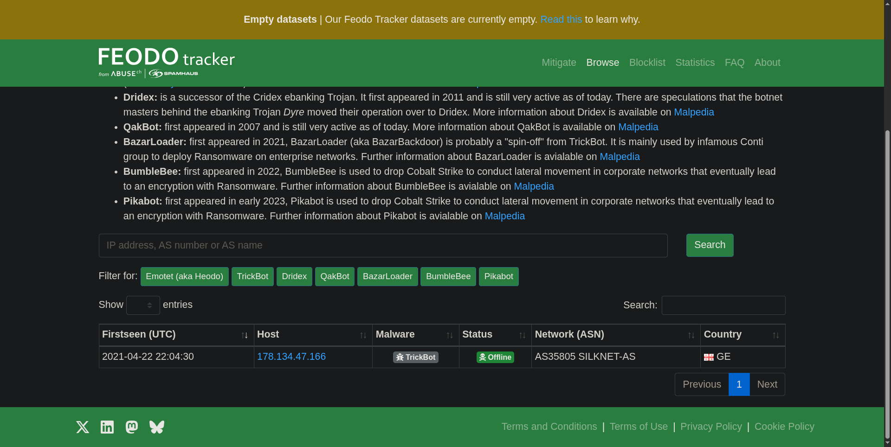

# 🛰️ Feodo Tracker

**Feodo Tracker** is a project within the Abuse.ch family focused on tracking botnet command-and-control (C2) infrastructure which was originally well known for tracking banking trojans such as Emotet, Dridex, and TrickBot.  
It provides timely lists of malicious IPs, domains, and associated metadata that analysts can use to detect, block, and investigate botnet activity.

---

## 🧠 Overview

Feodo Tracker aggregates telemetry, reports, and community feeds to identify C2 hosts used by specific botnets. Typical outputs include:

- Active C2 IP addresses and domains  
- Timestamps and first-seen / last-seen metadata  
- Related campaign or botnet attribution (when available)  
- Contextual notes and references to related reports

Feodo Tracker is particularly useful for:
- Blocking known C2 hosts at network boundaries (firewalls, IPS)  
- Enriching alerts with attribution context in SIEM/EDR platforms  
- Hunting for lateral or outbound beaconing to known malicious infrastructure

---

## 📊 Core Features

| Feature | Description |
|--------|-------------|
| **C2 IP / Domain Lists** | Curated lists of known command-and-control endpoints |
| **Timestamps / Metadata** | First-seen/last-seen indicators and reporting context |
| **Attribution** | Indications of which botnet family (e.g., Emotet, TrickBot) is associated |
| **Export / API** | Machine-readable exports or feeds for automation and blocking |

---

## 🧪 Example Scenario (TryHackMe Exercise)

In the TryHackMe exercise, I used **Feodo Tracker** to investigate a suspected C2 domain and identify the geographic attribution.

## Question

- Question 1: Which country is the botnet IP address 178.134.47.166 associated with according to FeodoTracker?

- The room provided a screenshot (`FT1.png`) showing the Feodo Tracker output.  
- From the Feodo Tracker data in the screenshot, I identified the **country** associated with the C2 entry as **Georgia**.

> **Note:** The exercise used a provided screenshot (room image) to ensure consistent answers; live lookups may vary over time.

---

## 💡 How I Used It Practically
- Queried Feodo Tracker entries and cross-referenced IPs/domains with other CTI sources (VirusTotal, URLScan.io) for confirmation.  
- Used the reported IPs to create temporary firewall block rules in lab environments and to generate enrichment for SIEM alerts.  
- Documented the FT1 screenshot as evidence of the attribution during the exercise.

---

## 🧠 Reflection

Feodo Tracker is a focused resource for **botnet infrastructure tracking**—it’s compact but highly actionable.  
For SOC workflows, Feodo entries are especially valuable when used as part of a multi-source enrichment strategy (combine Feodo data with sandbox reports, passive DNS, and reputation feeds).  
Because C2 infrastructure changes rapidly, Feodo Tracker is most useful when incorporated into automated blocking/enrichment rather than manual one-off checks.

---

## 🧰 Tools / Platforms Used While Learning
- **Feodo Tracker (Abuse.ch)** — primary data source for the exercise  
- **VirusTotal / URLScan.io** — corroboration and enrichment  
- **TryHackMe Lab Environment** — hands-on practice and screenshot evidence  
- **Markdown & Screenshot Documentation**
