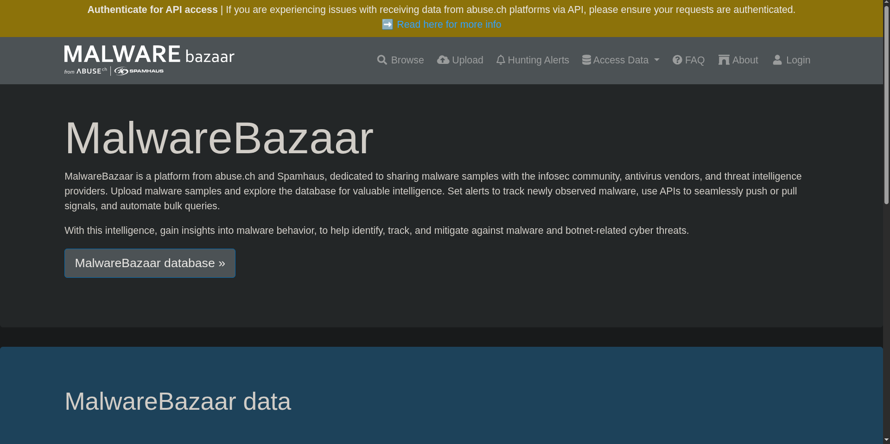

🧩 MalwareBazaar

MalwareBazaar is a community-driven malware intelligence platform developed by Abuse.ch, a project hosted by the Bern University of Applied Sciences in Switzerland.  
It serves as a public repository for sharing, analyzing, and distributing malware samples and their associated metadata.  
This makes it an essential tool for cybersecurity researchers, malware analysts, and threat intelligence professionals.

🧠 Overview
MalwareBazaar allows users to upload, download, and search for malware samples based on a variety of indicators including:

- File hash (MD5, SHA1, SHA256)
- File type or family
- Tags and detection names
- YARA rule matches
- Signature and vendor detections

The platform’s main goal is to support the global cybersecurity community in identifying and mitigating threats by making verified malware samples freely available for research and defensive purposes.

📊 Core Features

Feature | Description
--- | ---
Malware Upload | Analysts can contribute samples to the community for shared research
Sample Search | Search by hash, signature, tag, or malware family
YARA Rule Matching | Identify files that match custom or shared YARA rules
API Access | Automate sample retrieval, submission, or intelligence integration
Vendor Detections | Displays AV engine results for uploaded samples

🖼️ Example Scenario

In one of the TryHackMe rooms, MalwareBazaar was used to investigate a suspicious file hash believed to be part of a malware campaign.  
By querying the hash in MalwareBazaar, I was able to view:

- Its associated malware family  
- Detection names across AV vendors  
- File type and signature  
- Related submissions uploaded by other analysts

The screenshot above (`screenshots/MB1.png`) shows the MalwareBazaar dashboard captured during the exercise.

💡 Comparison: MalwareBazaar vs VirusTotal
While both platforms allow users to analyze malware samples, their focus differs slightly:

Aspect | MalwareBazaar | VirusTotal
--- | --- | ---
Primary Use | Sharing and retrieving raw malware samples | Multi-engine scanning and reputation analysis
User Base | Researchers, malware analysts | Security teams, SOCs, general users
Data Type | Malware binaries, metadata | Scans, behavioral data, reputation results
Best For | Sample-based intelligence and YARA hunting | Threat validation and quick detection overview

🧠 Reflection
MalwareBazaar offers a more technical and raw look into malware analysis compared to VirusTotal.  
It’s especially useful for researchers who want direct access to samples for reverse engineering or behavior testing.  
Personally, I tend to use VirusTotal more frequently for its ease of use and visual reports, but MalwareBazaar provides deeper value when I need to focus on YARA matching, signature hunting, or collecting IOC data from verified sources.

🧰 Tools / Platforms Used While Learning:
- TryHackMe – Malware Analysis Room  
- MalwareBazaar Web Interface  
- VirusTotal for Comparison  
- Markdown & Screenshot Documentation
