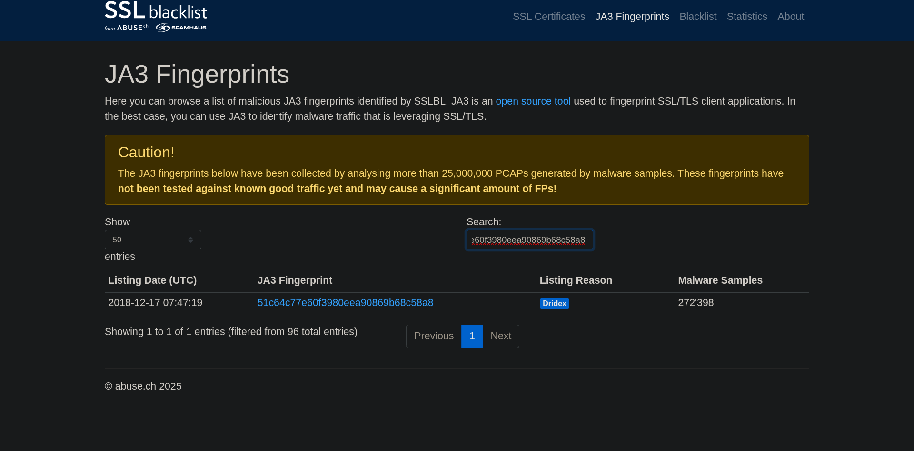

# 🔒 SSL Blacklist

**SSL Blacklist** is an Abuse.ch project focused on collecting and sharing **malicious SSL/TLS certificate indicators** and JA3/JA3S fingerprints.  
It helps analysts identify suspicious TLS certificates and fingerprint patterns commonly used by malware, botnets, and evasive infrastructure.

---

## 🧠 Overview

SSL Blacklist aggregates SSL certificate data and JA3/JA3S fingerprints to help security teams:

- Identify **malicious or suspicious certificates** used by threat actors  
- Correlate JA3/JA3S fingerprints with known malicious tooling or campaigns  
- Build blocklists for defensive controls (proxy, firewall, IDS)  
- Enrich alerts with TLS-based IOCs for more accurate triage

This resource is particularly useful when investigating encrypted command-and-control channels or detecting suspicious TLS usage that reputation feeds might miss.

---

## 📊 Core Features

| Feature | Description |
|--------|-------------|
| **Certificate Listings** | Known malicious SSL certificate details (subject, issuer, validity, serials) |
| **JA3 / JA3S Fingerprints** | TLS client/server fingerprinting to identify suspicious client/server stacks |
| **IP / Domain Associations** | Links between certificates/fingerprints and observed endpoints |
| **Export / Feeds** | Machine-readable lists for automated ingestion and blocking |

---

## 🧪 Example Scenario (TryHackMe Exercise)

During the TryHackMe exercise, I used **SSL Blacklist** to investigate a certificate/fingerprint associated with suspicious activity.  
The room provided a screenshot (`SSLB1.png`) showing the SSL Blacklist output for the indicator in question.

From the screenshot, the result indicated the malware family **Dridex**.

> **Note:** The room supplied a screenshot to ensure consistent answers; live lookups may show different results as data updates over time.

---

## 💡 Practical Usage & Findings

- I used the SSL Blacklist entry to correlate a JA3 fingerprint with other CTI sources (Feodo Tracker, VirusTotal), and the combined evidence pointed to **Dridex** activity.  
- This type of TLS-based IOC is helpful when attackers use encrypted channels to hide C2 traffic because fingerprinting can reveal consistent tooling even when domains/IPs rotate.

---

## 🧠 Reflection

I enjoy using **SSL Blacklist** alongside **Feodo Tracker** because they complement each other: SSL Blacklist reveals **TLS/JA3-based indicators**, while Feodo Tracker focuses on **botnet C2 infrastructure**. Together, they helped me learn more about **Dridex** and similar botnet families, including how these groups manage encrypted communications and evolve their infrastructure.

---

## 🧰 Tools / Platforms Used While Learning
- SSL Blacklist (Abuse.ch) — primary data source for TLS/JA3 indicators  
- Feodo Tracker — C2 and botnet infrastructure correlation  
- VirusTotal / URLScan.io — additional enrichment and validation  
- TryHackMe lab environment — guided exercise and screenshot evidence  
- Markdown & Screenshot Documentation
