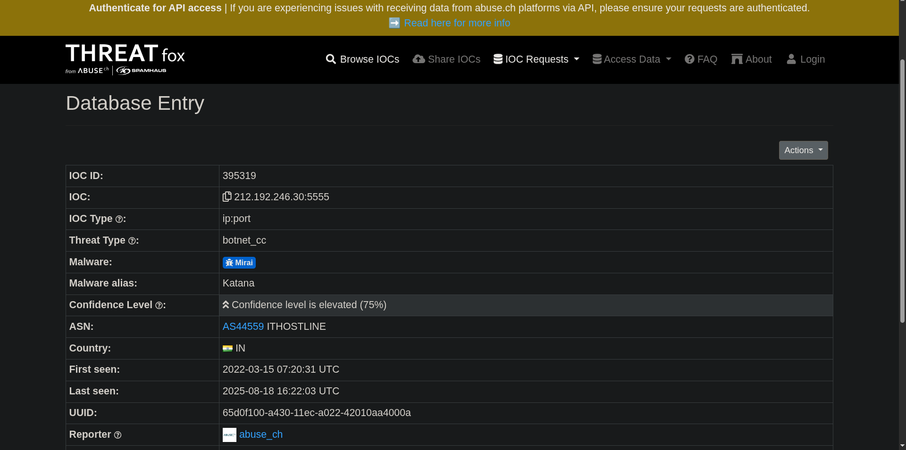

# 🕵️‍♂️ ThreatFox

**ThreatFox** is an Abuse.ch project focused on sharing **Indicators of Compromise (IOCs)** such as malware domains, IP addresses, URLs, and threat actor tools.  
It provides a community-driven platform for cybersecurity analysts to **track, share, and correlate threat intelligence** in real time.

---

## 🧠 Overview

ThreatFox enables security teams to:

- Access verified **IOCs** for threat detection  
- Correlate malicious infrastructure with malware campaigns  
- Analyze **URLs, domains, IPs, and tools** associated with attacks  
- Share findings with the broader security community  

The platform is especially useful for **network monitoring**, **threat hunting**, and **incident response**.

---

## 📊 Core Features

| Feature | Description |
|--------|-------------|
| **IOC Database** | Access curated lists of threat indicators shared by the community |
| **Malware & Tool Tagging** | Identify specific tools or malware families related to the IOCs |
| **Search & Filter** | Quickly find relevant indicators by type, threat actor, or campaign |
| **Integration with IDS** | Data can be used to create rules for **Suricata** or other IDS/IPS systems |

---

## 🧪 Example Scenario (TryHackMe Exercise)

During the TryHackMe exercise, I investigated an IOC string but initially struggled to find the answer because the string included a port.  

Question 1: The IOC 212.192.246.30:5555 is identified under which malware alias name on ThreatFox?

After performing a **direct Google search**, I successfully identified the Malware as **Katana**.

> **Note:** Screenshots were provided in the room to standardize answers; live lookups may vary as new indicators are continuously submitted.

---

## 💡 Practical Usage & Findings

- ThreatFox is particularly effective for **extracting IOCs quickly** and correlating them with specific malware campaigns.  
- The platform’s IOCs can be directly integrated into **Suricata IDS rules** to enhance real-time network threat detection.  
- Compared to other tools, ThreatFox emphasizes **community-driven and up-to-date indicator sharing**, which is essential for proactive threat hunting.

---

## 🧠 Reflection

I enjoyed using ThreatFox because it emphasizes real-world IOC usage and integration with **network defense tools** like Suricata.  
This exercise enhanced my ability to **identify threat infrastructure, research tools, and create actionable detections**, improving my practical experience in threat intelligence.

---

## 🧰 Tools / Platforms Used While Learning
- ThreatFox (Abuse.ch) — primary source for IOCs  
- Suricata IDS — practical integration of indicators into network monitoring  
- TryHackMe lab environment — guided exercises and screenshot evidence  
- Markdown & Screenshot Documentation
