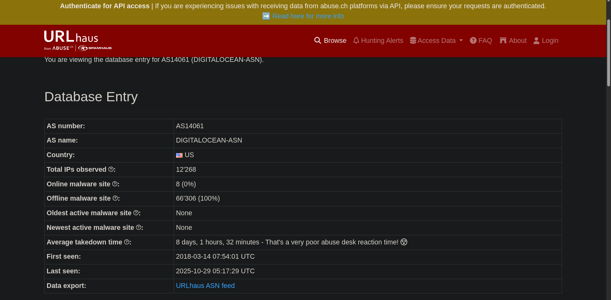

# 🌐 URLHaus

**URLHaus** is an Abuse.ch project designed to collect and share **malicious URLs and domains** used for distributing malware.  
It provides a centralized repository for researchers, analysts, and threat intelligence professionals to identify, track, and mitigate malicious web infrastructure.

---

## 🧠 Overview

URLHaus helps security teams by providing:

- Verified lists of **malicious URLs and domains**  
- Metadata about malware distribution campaigns  
- Associated **IP addresses, ASN numbers, and hosting providers**  
- Information on malware families linked to URLs  

The platform is particularly useful for **blocking malicious domains**, monitoring web threats, and enriching threat intelligence feeds.

---

## 📊 Core Features

| Feature | Description |
|--------|-------------|
| **Malicious URL Database** | Access to URLs actively used for malware distribution |
| **ASN & IP Mapping** | Identify hosting networks and responsible ASNs for malicious infrastructure |
| **Malware Family Tagging** | Correlate URLs with known malware campaigns or families |
| **Downloadable Feeds** | Machine-readable CSVs and JSON for integration into SIEMs or threat platforms |

---

## 🧪 Example Scenario (TryHackMe Exercise)

During the TryHackMe exercise, I investigated a malicious URL by searching its **ASN number** on URLHaus.  
Although initially I had trouble locating the ASN section, I successfully identified the hosting provider as **Digital Ocean**.

> **Note:** The room provided a screenshot to standardize answers. Live lookups may vary as new malicious URLs are continuously added.

---

## 💡 Practical Usage & Findings

- URLHaus allows analysts to **trace malicious URLs back to their hosting providers** using ASN information.  
- Compared to platforms like **VirusTotal**, URLHaus emphasizes **ASN and hosting network information**, which can be critical for infrastructure mapping and identifying potential threat actor patterns.  
- Understanding ASNs can help analysts **block or monitor malicious hosting providers** systematically.

---

## 🧠 Reflection

I enjoyed using URLHaus because it highlights aspects of malicious infrastructure (like ASNs) that are often overlooked on other platforms such as VirusTotal.  
This exercise strengthened my practical understanding of **malware distribution networks** and how to leverage ASN data for threat hunting.

---

## 🧰 Tools / Platforms Used While Learning
- URLHaus (Abuse.ch) — primary data source for malicious URLs and ASN info  
- VirusTotal — for comparative analysis  
- TryHackMe lab environment — guided exercises and screenshot evidence  
- Markdown & Screenshot Documentation
