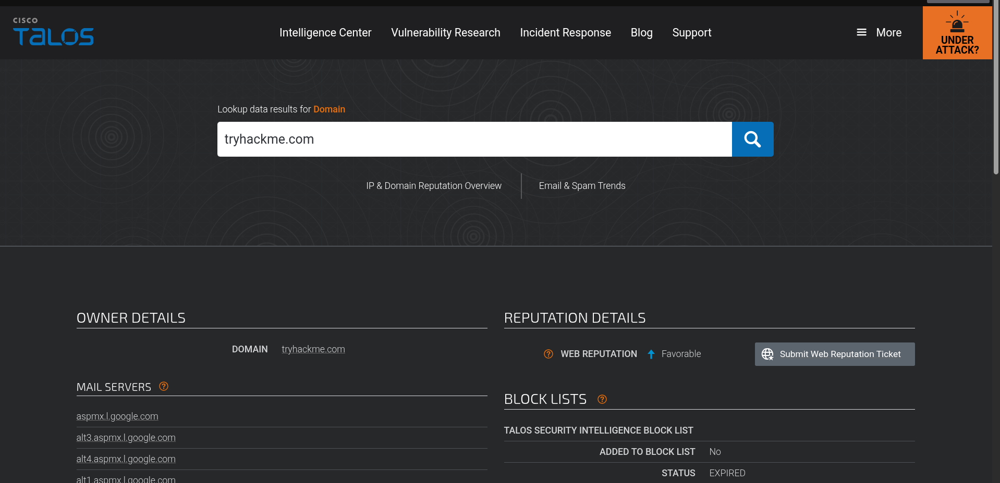
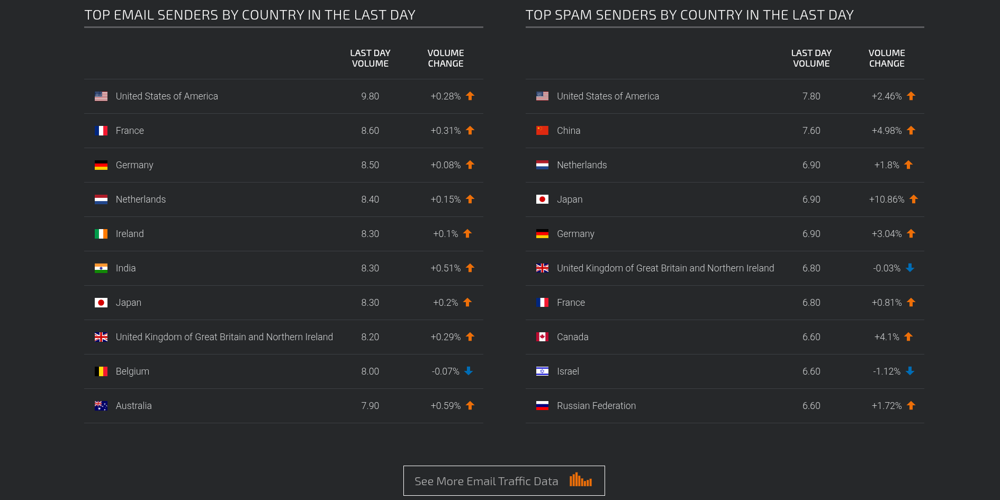

# 🛡️ Cisco Talos Intelligence

**Cisco Talos** is Cisco’s dedicated cybersecurity team that provides actionable intelligence, visibility on indicators, and protection against emerging threats. The **Talos Intelligence platform** leverages massive data collected from Cisco products to help organizations detect, analyze, and respond to threats.

---

## 🧠 Overview

Talos is organized into six key teams:

- **Threat Intelligence & Interdiction** – Correlates and tracks threats, turning IOCs into context-rich intelligence  
- **Detection Research** – Analyzes malware and vulnerabilities to create detection rules and signatures  
- **Engineering & Development** – Maintains inspection engines and ensures detection tools are up-to-date  
- **Vulnerability Research & Discovery** – Works with vendors to identify and report vulnerabilities  
- **Communities** – Manages open-source initiatives and community engagement  
- **Global Outreach** – Disseminates intelligence through publications and alerts  

For more detailed information, refer to the [Cisco Talos White Paper](https://www.cisco.com/c/en/us/products/security/talos.html).

---

## 📊 Dashboard & Tools

Upon accessing the Talos Intelligence open-source solution, the dashboard provides a **reputation lookup tool with a world map**, highlighting:

- Legitimate, spam, or malware email traffic across countries  
- Details for selected IPs or hostnames, including traffic volume and type  

---

### Primary Analyst Tabs

| Tab | Description |
|-----|-------------|
| **Vulnerability Information** | Disclosed and zero-day vulnerabilities with CVE numbers, CVSS scores, timelines, and applicable Snort rules |
| **Reputation Center** | Searchable threat data for IPs, SHA256 file hashes, email and spam analysis |
| **Email & Spam Data** | Provides top email sender countries and spam origin tracking |

---

## 💡 Practical Usage & Findings

- Used **Talos Reputation Center** to investigate the `tryhackme.com` domain  
- Explored **top email sender countries** and spam origins  
- Talos provides actionable intelligence beyond what VirusTotal offers, including email traffic analysis, vulnerability timelines, and global threat visibility  

---

## 🧠 Reflection

I frequently use Cisco Talos in addition to VirusTotal because of its **comprehensive modules**, which provide a broad range of threat intelligence from IP and domain analysis to spam and malware insights.  
The platform is highly practical for **CTI analysts, SOC operations, and incident response teams**.

---

## 🧰 Tools / Platforms Used While Learning

- Cisco Talos Intelligence  
- TryHackMe lab exercises  
- VirusTotal (for comparison)  
- Markdown & Screenshot documentation
