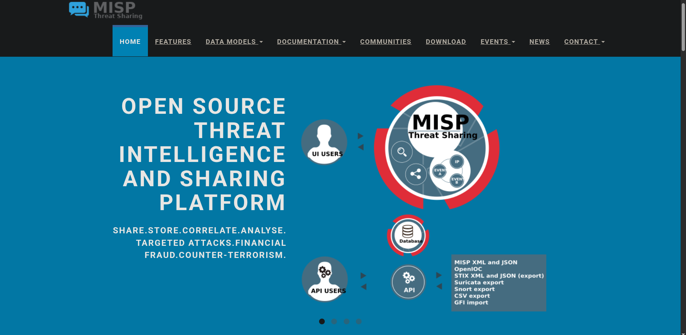
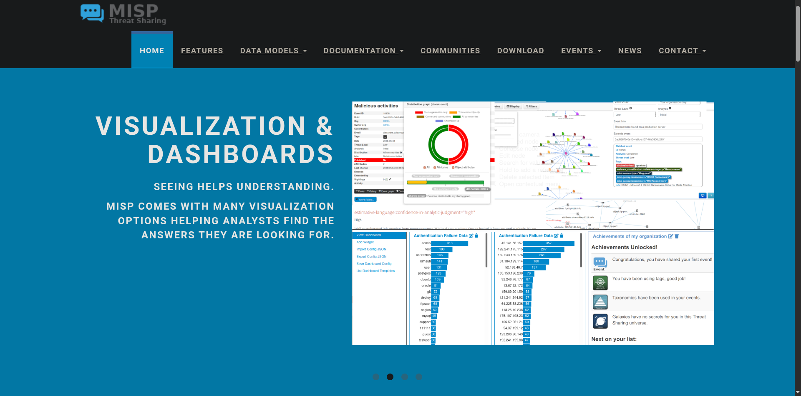
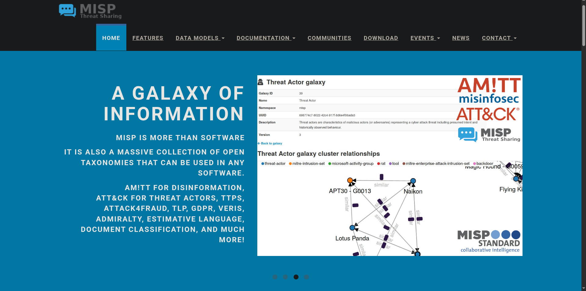
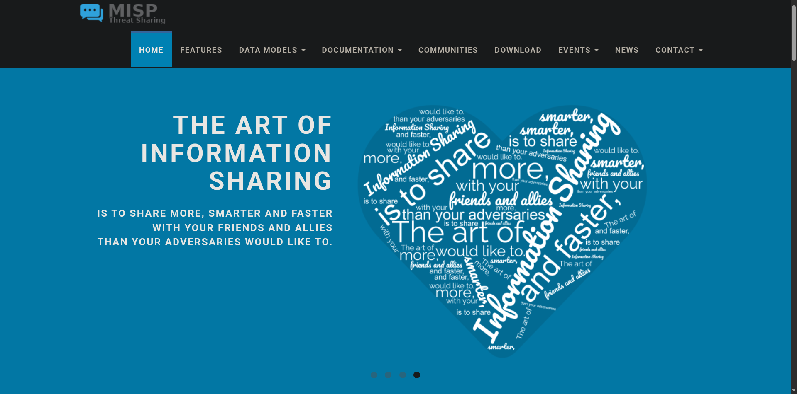

# 🧩 MISP – Malware Information Sharing Platform

## 🧠 Overview

**MISP (Malware Information Sharing Platform)** is an open-source threat intelligence system designed to help cybersecurity professionals **collect, store, and share Indicators of Compromise (IOCs)** efficiently.  
Its main strength lies in enabling trusted communities to collaborate and exchange information about **malware, threat actors, and attack campaigns** in real time.

I found MISP to be more than just a database but rather it’s essentially a **collaborative hub** that encourages defenders to pool knowledge, reducing duplication and improving the overall quality of shared intelligence.

---

## 🌐 Exploring MISP

When I first accessed MISP’s interface, what stood out was how intuitive and data-driven it felt. The platform clearly emphasises **“sharing more with friends than adversaries do,”** and this idea carries through everything it does — from the dashboard layout to how events are structured.

It’s built for all kinds of environments, whether small research teams or national CERTs, and its modular design makes it surprisingly easy to adapt.  
Seeing the visual flow of data between communities helped me understand how **distributed intelligence sharing** works in real-world SOC settings.

---

## 📊 Dashboard & Visualisation

The MISP dashboard provides a detailed overview of events, attributes, and their correlations. I really liked how easy it was to see **relationships between incidents and IOCs** without having to manually dig through data.  
The visual representation of data helps bring patterns to light, especially when dealing with multiple campaigns that might be related.

It also supports **data enrichment**, which makes a big difference when you’re trying to validate IOCs or gather additional context from external sources.

---

## ⚙️ Core Features

MISP’s functionality extends beyond data storage — it’s a complete ecosystem for sharing and analysis.  
Some of the features that stood out to me were:

- **IOC Database:** A structured way to manage technical and contextual threat data.  
- **Automatic Correlation:** Detects links between attributes and campaigns automatically.  
- **Flexible Sharing Models:** Lets you choose between private, semi-private, or public distribution.  
- **Integration Options:** Can connect with SIEMs, IDS/IPS, and other CTI tools.  
- **Event Graphs:** Useful for visualising how multiple events connect in larger threat campaigns.  
- **API Access:** Enables automation and deeper integration with other intelligence platforms.

---

## 🪐 Galaxy & Tagging System

One of my favourite parts of MISP is the **Galaxy and tagging system**. The Galaxy framework gives each event more depth by linking it to **malware families, threat actors, or campaigns**.  
It’s like a built-in reference library that connects the dots between isolated incidents.

Tagging, on the other hand, adds structure and meaning to events. For example, I used tags to define the **confidence level**, **data source**, and **sharing restrictions**.  
It’s a simple but powerful way to ensure that shared data remains consistent and usable for others in the community.

---

## ❤️ The Art of Sharing

MISP’s core philosophy really resonates with me to *“Share more with friends than adversaries do.”*  
That mindset transforms cybersecurity from a defensive, isolated practice into a **cooperative effort**. It made me appreciate how essential trust and openness are in building a strong CTI network.

Even with sensitive data, MISP manages to strike a balance between **security and collaboration**, thanks to features like role-based permissions and traffic light protocols.

---

## 💡 Reflection

Working with MISP gave me a better understanding of what **threat intelligence sharing** actually looks like in practice.  
Before this, I mostly saw CTI as data analysis, but MISP showed me how valuable structured collaboration can be especially when it’s done securely and transparently.

I also completed a small **hands-on project** within MISP where I experimented with event creation, tagging, and correlation.  
Like my other labs, I’ve placed this under the **CTFs & Projects** folder to keep everything neatly organised and easy to reference later.

---

## 🧰 Tools & Resources

- MISP Threat Intelligence Platform  
- OpenCTI  
- TheHive  
- TryHackMe Lab Environment  
- MITRE ATT&CK Framework  
- Markdown Documentation  

---
