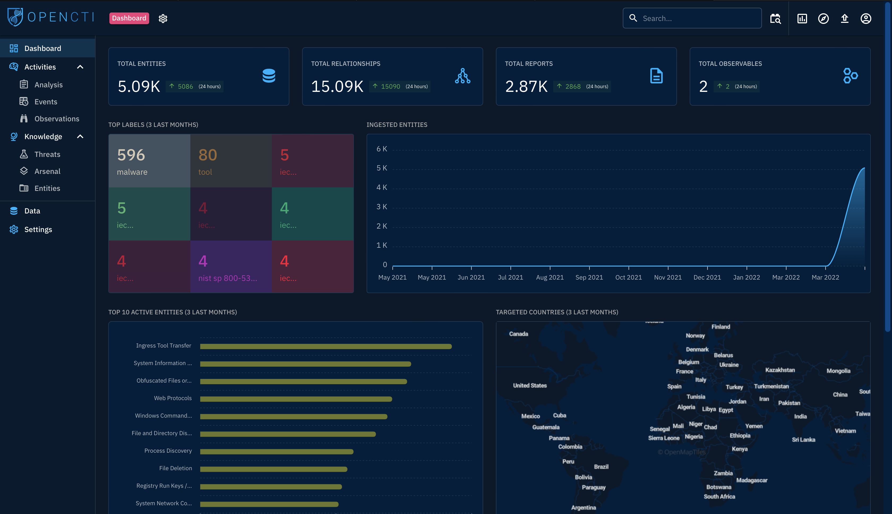

# 🧩 OpenCTI — Centralizing and Visualizing Cyber Threat Intelligence

**OpenCTI** (Open Cyber Threat Intelligence Platform) is an open-source framework designed to help organizations manage, analyze, and visualize their **Cyber Threat Intelligence (CTI)**. Developed through a collaboration with the **French National Cybersecurity Agency (ANSSI)**, the platform focuses on bringing together **technical and non-technical information** in a way that establishes clear relationships between threats, actors, campaigns, and indicators.

---

## 🎯 Objective & Purpose

The main goal of OpenCTI is to **streamline the handling of CTI data** which allows analysts to capitalise on intelligence from various sources and structure it using frameworks like **MITRE ATT&CK**.

It enables:
- Centralized storage and analysis of **threat campaigns, malware, and IOCs**
- Visualization of relationships between data points (e.g., malware → campaign → intrusion set)
- Integration with other major intelligence platforms such as **MISP** and **TheHive**
- Cross-correlation and enrichment of information across different threat feeds

---

## 🧠 My Observations & Experience

When I explored **OpenCTI** through the TryHackMe room, I found the dashboard intuitive yet deeply powerful. It provides multiple visualization options and data relationship graphs that help analysts understand how different indicators connect to broader campaigns.

What stood out the most for me was **its high level of customization** where OpenCTI allows seamless integration with frameworks like **MITRE ATT&CK** and supports automated feeds from other tools. This makes it a top-tier option for organizations that want to **build their own internal threat intelligence ecosystem** without relying entirely on commercial products.

The fact that it’s **completely open-source** means analysts can modify or extend the platform’s features to suit specific use cases. From automated IOC ingestion to intelligence sharing between teams or agencies.

---

## 🧩 Key Features I Explored

- **Structured Data Storage:** Handles threat entities like campaigns, actors, malware, and observables within a connected graph.  
- **Visualization Engine:** Displays interactive relationships between entities for clearer analysis.  
- **MITRE ATT&CK Integration:** Structures adversary techniques and tactics into the data model.  
- **External Integrations:** Connects with platforms like MISP (for indicators) and TheHive (for case management).  
- **API & Automation:** Offers a flexible API for custom automation and data ingestion.

---

## 💬 Personal Reflection

OpenCTI felt like the **next evolution** of CTI management by bridging the gap between technical detection data and higher-level strategic intelligence. It’s more than just a database; it’s a **knowledge graph for threats**, enabling teams to move from raw data toward actionable insights.

While I completed an introductory exercise using the tool during my TryHackMe training, I decided to categorize that practical section under the **CTFs & Projects** folder for better structure and readability within my documentation.

---

## 🧰 Summary of Tools & Integrations

| Integration | Purpose |
|--------------|----------|
| **MISP** | Feed and synchronize IOCs |
| **TheHive** | Case management and incident correlation |
| **MITRE ATT&CK** | Framework for tactics, techniques, and procedures (TTPs) |
| **Custom APIs** | Automation and enrichment scripts |

---

## 🧠 Final Thoughts

OpenCTI represents what modern threat intelligence platforms should strive to be; **transparent, modular, and extensible**. For CTI analysts, SOC teams, and researchers, it provides a unified space where intelligence from multiple sources can be visualized, correlated, and shared efficiently.

Its open nature ensures that both small organizations and large enterprises can adopt it without licensing barriers, making it an invaluable tool in the evolving cybersecurity landscape.
