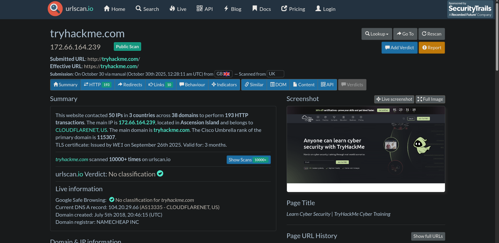

# 🌐 URLScan.io

Urlscan.io is a free and powerful online service used for **scanning and analyzing websites**.  
It automates the process of browsing and crawling through URLs to record their activities, network interactions, and linked resources which makes it a valuable tool for **cyber threat intelligence, phishing analysis, and incident investigation**.

---

## 🧩 Overview

When a URL is submitted, **Urlscan.io** performs an automated analysis that records:

- Domains and IP addresses contacted  
- Web resources and requests made by the page  
- A **snapshot** of the webpage  
- Technologies and frameworks used  
- Associated **metadata** such as certificates, redirects, and page history  

The platform provides two main views:

- **Recent Scans** – Displays a list of the most recently analyzed websites  
- **Live Scans** – Shows URLs currently being scanned in real time  

This combination of historical and live analysis makes Urlscan.io an excellent resource for **incident response teams, SOC analysts, and threat intelligence researchers**.

---

## 📊 Scan Results

URL scan results contain a large amount of information. Some of the most useful sections include:

| Section | Description |
|----------|--------------|
| **Summary** | General information about the URL — IP address, domain registrar, page history, and a screenshot of the site |
| **HTTP** | Details about the HTTP connections made to the site, including fetched data and file types received |
| **Redirects** | Lists both HTTP and client-side redirects |
| **Links** | Displays all outbound links found on the homepage |
| **Behaviour** | Details cookies, variables, and scripts — helpful for identifying frameworks and third-party integrations |
| **Indicators** | Provides IPs, domains, and hashes related to the scanned site (not all are malicious) |

🖼️ *Example: URL Scan results for the English Premier League website*

> **Note:**  
> Due to the dynamic nature of web content, results may differ depending on when the scan is performed. Which means that domains, redirects, and IPs can change frequently.

---

## 🧠 Scenario: Scanning TryHackMe’s Domain

In this scenario, I was tasked with analyzing the domain **tryhackme.com** using Urlscan.io.  
The TryHackMe room provided a screenshot named since live data would produce different results at different times.  

However, I also performed my **own independent scan** on Urlscan.io to gain hands-on experience and proof of this can be found in the screenshot shown below.

---

### 🧾 Findings from the Room Screenshot (URL1.png)
| Question | Answer |
|-----------|---------|
| **TryHackMe’s Cisco Umbrella Rank** | 345612 |
| **Number of Domains Identified** | 13 |
| **Main Domain Registrar** | NAMECHEAP INC |
| **Main IP Address Identified** | 2606:4700:10::ac43:1b0a |

---

## 💡 Key Takeaways

- Urlscan.io is a **powerful OSINT and CTI platform** for investigating URLs and web-based threats.  
- It provides both **visual snapshots and deep network-level metadata**, which can help identify potential malicious behavior or compromise indicators.  
- Combining it with other tools like **VirusTotal**, **Abuse.ch**, or **PhishTool** enhances the accuracy of threat attribution and domain reputation analysis.  
- Live scanning offers dynamic insights into current website behavior making it an ideal resource for **incident triage** and **phishing investigation**.

---

## 🧠 Reflection

Performing this task helped reinforce how crucial automated tools are in **threat intelligence workflows**.  
Using both the provided screenshot and my own scan allowed me to understand how URLScan.io captures **network relationships, site behavior, and resource calls** that might indicate compromise.

It’s a simple yet powerful platform for SOC analysts, threat hunters, and CTI professionals alike by bridging the gap between **OSINT reconnaissance** and **forensic investigation**.

---

### 🧰 Tools / Platforms Used While Learning:
- **TryHackMe – URLScan.io Room**  
- **Urlscan.io Web Interface**  
- **TryHackMe VM Environment**  
- **Markdown & Screenshot Documentation**
