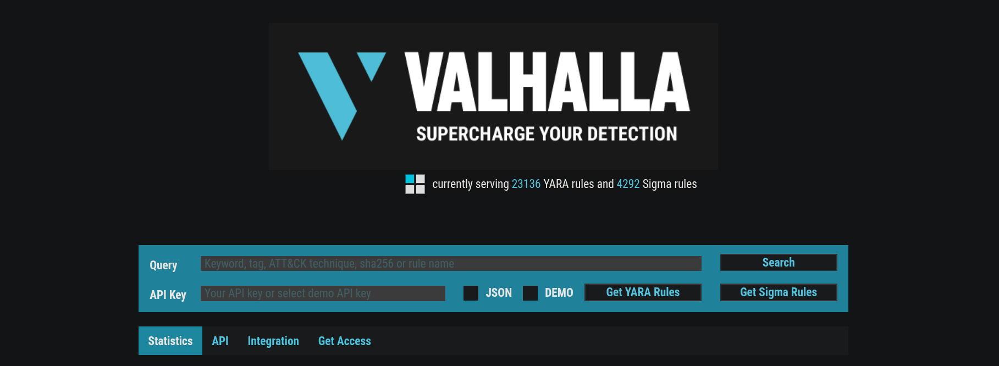
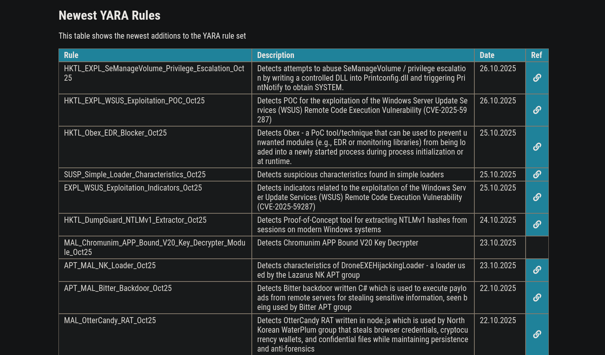

# 🏛️ Valhalla — Community YARA Feed & Rule Repository

**Valhalla** is an online YARA feed maintained by Nextron-Systems (Florian Roth). It provides thousands of community-contributed, hand-crafted YARA and Sigma rules that help boost detection capabilities across incident response and threat-hunting workflows.

---

## 🧠 Overview

Valhalla aggregates high-quality rules that are searchable by keyword, tag, ATT&CK technique, SHA256, or rule name. It’s an excellent resource when you need to:

- Research whether a file or behavior has been previously observed and codified into a rule  
- Find community-vetted YARA rules to import, test, or adapt for your environment  
- Discover Sigma rules for log-based detection and SIEM correlation

From the Valhalla homepage I visited during the exercise, the feed was serving **23,136 YARA rules** and **4,292 Sigma rules**, which immediately showed me the scale and usefulness of the project.

---

## 🔍 How I Used Valhalla

I used Valhalla to research the suspicious web-shell files I had previously analysed with LOKI and YarGen:

- Searched Valhalla by relevant keywords and tags to see if similar web-shells or indicators already had published rules.  
- Reviewed rule metadata (name, description, reference links, submission date) to understand rule context and confidence.  
- Cross-referenced Valhalla rules with the YARA rule YarGen produced to validate indicators and reduce false positives.

For example, the feed showed recently added rules such as:
- `HKTL_EXPL_SeManageVolume_Privilege_Escalation_Oct25` — a rule that detects attempts to abuse `SeManageVolume` for privilege escalation by writing a controlled DLL into `PrintConfig.dll` and triggering `PrintNotify` to obtain SYSTEM.

Looking at the rule metadata (name, description, date, and references) helped me justify remediation steps to stakeholders who needed evidence before removing files from production systems.

---

## 💡 Practical Takeaways

- **Speed up validation:** Valhalla allowed me to quickly find existing detection logic for similar threats instead of reinventing the wheel.  
- **Improve confidence:** Community-vetted rules (with references and dates) make it easier to justify containment or eradication actions.  
- **Rule sources:** I used Valhalla rules as inspiration — importing well-written detections and adapting them to my environment, or using them to sanity-check YarGen outputs.  
- **ATT&CK mapping:** Searching by ATT&CK technique helped connect observed behaviour to adversary tactics, which is useful for reports and incident timelines.

---

## 🧠 Reflection

Valhalla is a powerful complement to tools like **YarGen** and **LOKI**. While YarGen helps generate candidate signatures from specific samples and LOKI uncovers local indicators, Valhalla provides the **community context** in which thousands of rules and references that can validate and accelerate detection and response.

For practical threat-hunting and SOC workflows, Valhalla is now one of the first places I check after I have a suspicious artifact or behavior: it saves time, adds context, and helps build stronger, evidence-based cases for action.

---

## 🧰 Tools / Platforms I Used While Learning

- Valhalla (Nextron-Systems) — rule discovery and research  
- YarGen — generated YARA rules from suspicious files  
- LOKI — local endpoint IOC scanning  
- YARA CLI — testing and validating rules  
- TryHackMe labs for guided exercises  
- Markdown & Screenshot documentation
