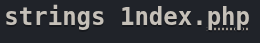
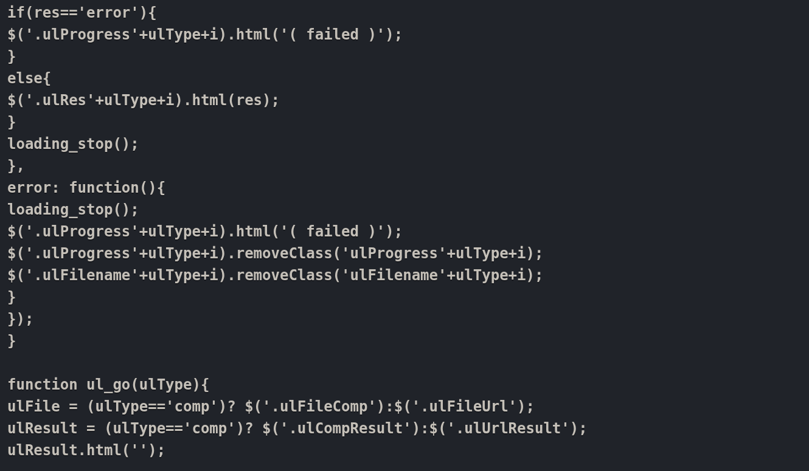
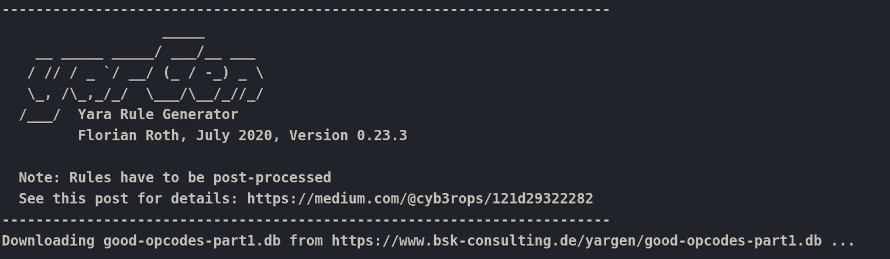
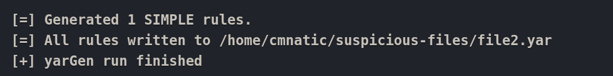

# 🛡️ YarGen — Generating YARA Rules Efficiently

When I encountered a file that **Loki didn’t flag**, I realized I needed to create a YARA rule to detect it across my environment. This is a common scenario during an incident where malicious files must be identified quickly and accurately.

---

## 🧠 The Challenge

I started by inspecting the suspicious file `index.php`. Running a **string extraction command** against it showed over **3,500 lines of strings**, making it extremely difficult to manually identify potentially malicious patterns.  

Trying to sift through all of these strings line by line highlighted how **time-consuming and error-prone** manual rule creation can be.  

---

## 📊 Using YarGen

I turned to **YarGen**, a YARA rule generator created by Florian Roth. This tool allows you to automatically generate YARA rules by extracting strings from malware while **excluding strings found in goodware** to minimize false positives.

I started the YarGen program and familiarized myself with its workflow.  

Next, I ran YarGen against my suspicious file to generate a YARA rule. The tool created a simple rule that could then be used to flag the file in my environment.  

---

## 💡 My Process & Observations

- YarGen **dramatically reduced the workload**, saving me from manually analyzing thousands of strings.  
- The generated rules were ready to integrate with **YARA CLI** for testing.  
- Reviewing the output helped me understand how automated tools can complement manual rule creation, especially when working with large datasets.  
- This exercise reinforced the connection between **YarGen** and the broader **YARA rules** ecosystem, showing me how automation can help streamline threat detection.

---

## 🔗 Further Reading

- [YarGen Official Documentation](https://www.bsk-consulting.de/yargen/)  
- [How to Write Simple, Sound YARA Rules - Part 1](https://www.bsk-consulting.de/2015/02/16/write-simple-sound-yara-rules/)  
- [Part 2](https://www.bsk-consulting.de/2015/10/17/how-to-write-simple-but-sound-yara-rules-part-2/)  
- [Part 3](https://www.bsk-consulting.de/2016/04/15/how-to-write-simple-but-sound-yara-rules-part-3/)  

---

## 🧰 Tools / Platforms I Used

- YarGen for automated YARA rule generation  
- YARA CLI to test the generated rules  
- Suspicious files from TryHackMe labs  
- Markdown & Screenshot documentation
